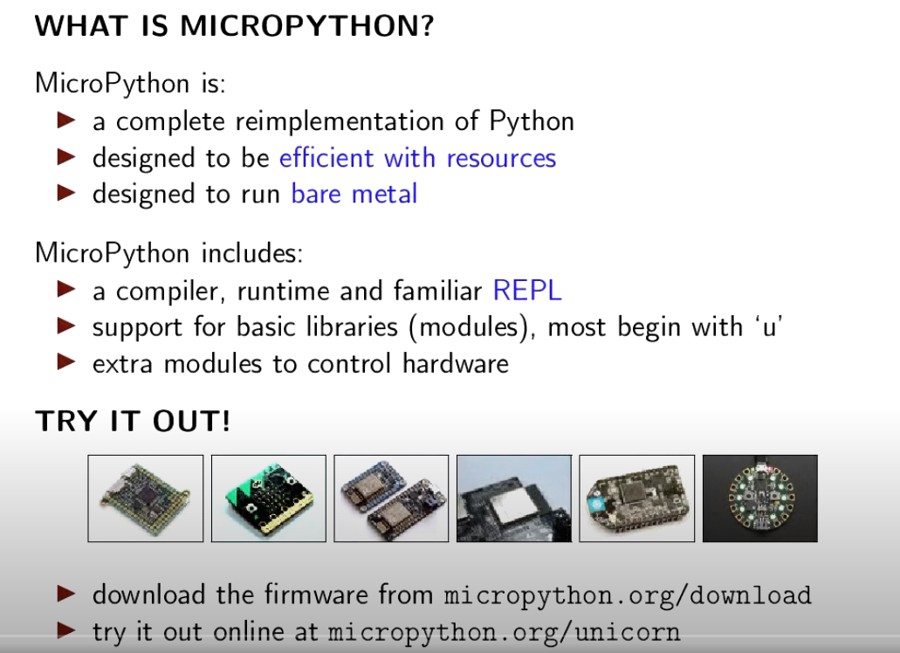

## ¿Qué es Micropython?

Micropython es una versión reducida del conocido intérprete del lenguaje Python adaptada para funcionar en dispositivos de menor capacidad que un ordenador personal.

Para reducir la necesidad de procesamiento y de memoria se han simplificado alguna de las posibilidades y eliminando gran parte de los módulos o librería y se incluyen por defecto.

También se han desarrollado versiones reducidas de estas librerías y módulos que podemos incluir ahora de manera opcional.

Nació en 2013,  cuando el físico y programador australiano **[Damien P. George](https://dpgeorge.net/)** creó una exitosa [campaña de crowdfunding en kickstarter](https://www.kickstarter.com/projects/214379695/micro-python-python-for-microcontrollers?lang=es) (tenía un objetivo de 15000£ y consiguió casi 100000£), dónde se desarrolló tanto el entorno de programación como una placa que fuera capaz de ejecutarlo la pyboard.

Los microcontroladores de aquella época básicamente Arduino y similares no eran capaces de desarrollar el procesamiento necesario para trabajar un intérprete de Python por eso fue necesario crear una nueva placa.

La placa además de un procesador STM32 suficientemente potente incluía algunos periféricos integrados que no facilitaban el hacer unas primeras pruebas de funcionamiento.

Podemos encontrar toda la documentación del proyecto en [su página](https://micropython.org/) y por supuesto en la [página del proyecto en github](https://github.com/micropython/micropython)

Una prueba del éxito del proyecto Micropython, es que en su página de github se han creado miles de versiones (se han hecho más de 4000 forks), de las empresas han derivado la versión para su propias placas. También se puede ver en el repositorio que son más 300 los desarrolladores que han contribuido al mismo y si miramos las actualizaciones podemos ver que hay cambios cada día.

A día de hoy son muchísimas las plataformas, además de la original [pyboard](http://micropython.org/download/pybv1), que permiten usar Micropython como lenguaje de programación como por ejemplo las [ESP](http://micropython.org/download/esp8266) y [ESP32](http://micropython.org/download/esp32) de Expressif, las de [m5Stack](https://github.com/m5stack/M5Stack_MicroPython), en las [STM32](http://micropython.org/download/stm32), en la famosísima [micro:bit](https://microbit.org/get-started/user-guide/python/) e incluso en la [Raspberry Pi](https://github.com/boochow/micropython-raspberrypi). De hecho uno de los entornos de programación [recomendados para la nueva Raspberry Pi Pico es micropython](http://micropython.org/download/rp2-pico).

Otras marcas, como Adafruit, han optado por crear una versión derivada, pero algo distinta, más optimizada para sus placas llamada [CircuitPython](https://learn.adafruit.com/bienvenido-a-circuitpython-2/que-es-circuitpython) y que puede funcionar en dispositivos aún más pequeños y limitados.

Una de las grandes ventajas que tiene el programar nuestro microcontroladores (vamos a llamarlos así aunque realmente sean un sistema más complejo) con Micropython, es que podemos trabajar interactivamente con ellos, es decir, **no necesitamos reprogramarlo** cada vez que queremos cambiar el programa con el que estamos trabajando sino que simplemente subimos al sistema ficheros con el código que se interpretaba.

Además este firmware base con el que trabajamos incluye de base muchas de las herramientas que usaremos en nuestros programas, como la gestión de ficheros, la conectividad de redes vía wifi, el manejo de la entrada salida y por supuesto el intérprete Python con toda la funcionalidad de alto nivel (gestión dinámica de memoria, colecciones, manejo de cadenas, ...)

Python es un lenguaje interpretado, es decir, no necesitamos compilar nuestro código para que funcione, sino que el intérprete lo va ejecutando línea a línea.

Desde el entorno de Micropython vamos a poder ejecutar órdenes de manera interactiva y también subir archivos que contiene el código de nuestros programas que podemos utilizar como lo hacemos en entornos más avanzados. También podemos usar estos ficheros como módulos o  librerías que usaremos desde nuestro código.

Micropython es un entorno que se va actualizando constantemente, con una gran cantidad de usuarios que lo usan. A día de hoy (Junio de 2023) se trabaja con la versión 1.20.

Todo el desarrollo es completamente Open Source y tenemos disponible todo lo necesario para recopilar lo de ahí que algunos fabricantes como Adafruit hayan creado versiones específicas para sus placas. La versión de Adafruit, se llama Circuitpython y funciona en las placas más potentes de la marca. Al tratarse de un desarrollo específico para sus propias placas en algún aspecto tiene mayor capacidad que los desarrollos más genéricos.

MicroPython es:

* Una implementación completa de Python
* Diseñado para ser eficiente con los recursos
* Diseñado para ejecutarse nativamente sobre el hardware (sin sistema operativo de por medio). 

Incluye

* Un compilador, entorno de ejecución y un REPL.
    * Gestión de memoria
    * Sistema de archivos
    * Control del hardware
* Librerías y módulos básicos (normalmente empiezan con 'u' por micro)
* Módulos extra para controlar determinado hardware

En esta presentación de Damien George sobre Micropython podemos ver estos detalles

[Vídeo: 0.1 Presentación de micropython](https://drive.google.com/file/d/12GklMQ_kHhmaNFoXg7iAVYlvCgptHA_4/view?usp=sharing)

