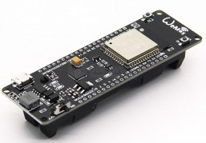
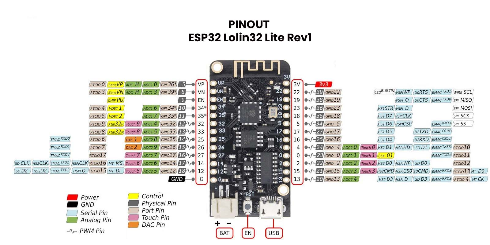

# Hardware compatible con micropython

[Modelos de ESP32](https://www.espressif.com/en/products/modules)

## Wemos D1 R32

Basado en ESP32 y con el formato de Arduino

## Wemos ESP32 battery

* Led incorporado el pin GPIO16 (¿D0?)

Pensado para incluir una batería LiPo 18650, incluye el cargador desde el USB
* Led verde indica que la batería está cargada y rojo que se está cargando

Pinout

(Imágenes cortesía de [geekworm](https://wiki.geekworm.com/WEMOS_ESP32_Board_with_18650_Battery_Holder)

PRO: 
* No incluye led de power para evitar consumos y aumentar la autonomía

## Lolin32

Incluye conector JST de batería y cargador desde el USB

## Lolin32 Lite

Incluye conector JST de batería y cargador desde el USB

Personalmente me gusta que en la misma placa tenemos mucha información:
* LED_BUILTIN 22 (Invertido)
* Pines con la numeración de ESP32
* DAC pines 25 y 26

Incluye 4MB Flash

Tiene los mismos pines que su hermana mayor salvo 5V, Tx y Rx y algunas GNDs

¿Podemos saber el nivel de carga?

## ESP32 con OLED

[detalles](https://wiki.geekworm.com/WEMOS_ESP32_Board_with_OLED)

## Características

### [¿Cuánta memoria tiene mi ESP32?](https://stackoverflow.com/questions/39631011/how-to-determine-flash-size-of-nodemcu)

run esptool.py -p <serial-port> flash_id 

### [Cómo usar PSRAM](https://thingpulse.com/esp32-how-to-use-psram/)

## TTGO - OLED

[Producto](http://www.lilygo.cn/prod_view.aspx?Id=1126)

https://www.instructables.com/TTGO-color-Display-With-Micropython-TTGO-T-display/

USB-C

1.14" OLED-color IPS ST7789V 1.14 Inch

ADC IN: 34

Power: 14

gpio4 backlight

[firmware y detalles](https://github.com/Xinyuan-LilyGO/TTGO-T-Display)

## TTGO - GPS - Lora

[Descripción del fabricante](https://github.com/LilyGO/TTGO-T-Beamls)

## ESP32 Dev Kit

Existen placas de diferentes fabricantes que responden bajo este nombre, se trata de versionas lévemente diferentes del diseño de referencia del fabricante del ESP32

[Detalles entre las versiones](https://www.studiopieters.nl/esp32-pinout/)

[modelo 1 ](https://descubrearduino.com/esp32-modulo-esp32-wroom-gpio-pinout/)

