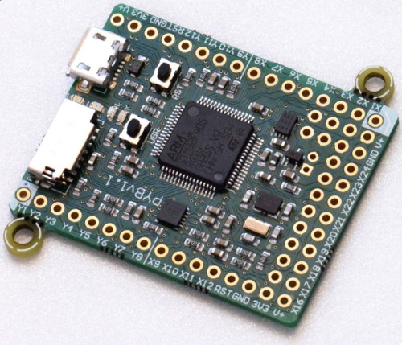

## PyBoard

Fue la placa diseñada por el creador de Micropython en el [proyecto de KickStarter](https://www.kickstarter.com/projects/214379695/micro-python-python-for-microcontrollers?lang=es)

* Procesador STM32F405RG, Cortex M4 a 168MHz
* 1024Kb de flash ROM y 192Kb de RAM
* MicroUSB
* Lector de tarjeta microSD
* Acelerómetro de 3 ejes MMA7660
* RTC
* 24 pines GPIO en los laterales y 5 pines GPIO en la parte de abajo.
* 3 entradas ADC de 12 bits
* 2 Salida DAC de 12 bits
* 4 Led en la placa (rojo, verde, amarillo y azul)
* Botón de reset y botón de usuario
* Funciona a 3.3

A día hoy se puede comprar una versión más moderna [aquí](https://store.micropython.org/product/PYBv1.1#_)

Detalles del pineado de pyBoard 1.1

