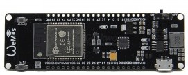
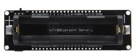

## Wemos ESP32 battery

* Led incorporado el pin GPIO16 (¿D0?)

Pensado para incluir una batería LiPo 18650, incluye el cargador desde el USB
* Led verde indica que la batería está cargada y rojo que se está cargando

Pinout

(Imágenes cortesía de [geekworm](https://wiki.geekworm.com/WEMOS_ESP32_Board_with_18650_Battery_Holder)

PRO: 
* No incluye led de power para evitar consumos y aumentar la autonomía

