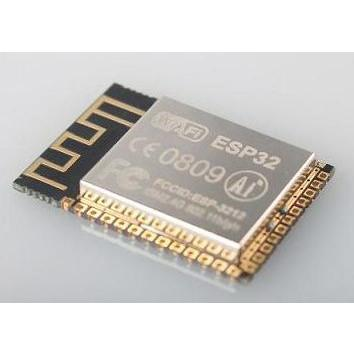
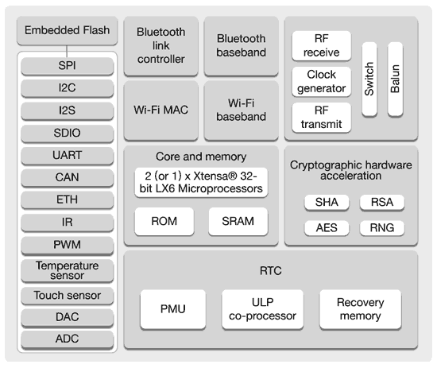

## ESP32

El módulo ESP32 del fabricante Espressif se ha convertido en un auténtico estándard del mundo maker

Incluye 

Este módulo es lo que se conoce como un System on Chip, un módulo que inlcuye todo lo necesario para operar el sistema (CPU, RAM, flash,....)

* Procesador Xtensa LX6 de 32 bits con doble core a 160Mhz 
* RAM de 520Kb
* Flash de hasta 16Mb
* Wifi
* Bluetooth v4.2
* 32 pines GPIO
* 18 canales ADC de 12 bits
* 2 DAC de 9 bits
* 16 salidas PWM

