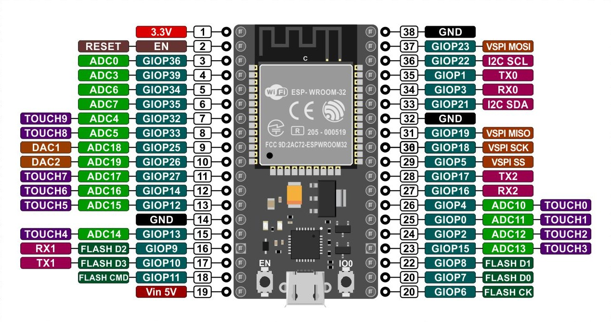

## ESP32 Dev Kit

Existen placas de diferentes fabricantes que responden bajo este nombre, se trata de versiones levemente diferentes del diseño de referencia del fabricante del ESP32

[Detalles entre las versiones](https://www.studiopieters.nl/esp32-pinout/)

[modelo 1 ](https://descubrearduino.com/esp32-modulo-esp32-wroom-gpio-pinout/)

[Modelos de ESP32](https://www.espressif.com/en/products/modules)

