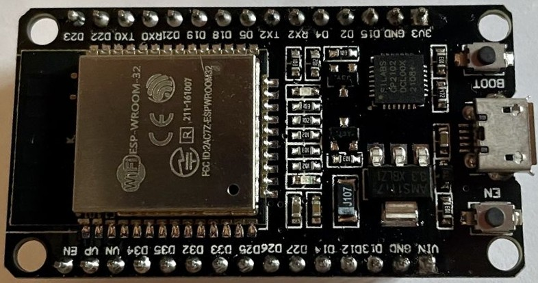

## ESP32 Dev Kit

Existen placas de diferentes fabricantes que responden bajo este nombre, se trata de versiones levemente diferentes del diseño de referencia del fabricante del ESP32:

Podemos encontrarlas con leves diferencias y por eso es muy importante que veamos sus detalles en la documentación del fabricante

Algunas de estas placas al ser versiones iniciales necesitan que pulsemos en el botón BOOT para su reprogramación, lo que funciona automáticamente en modelos más modernos.

