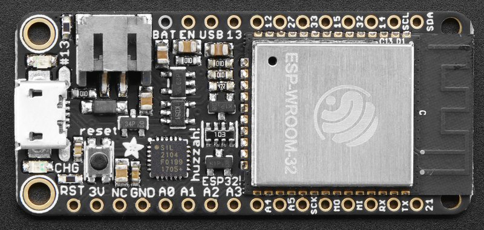
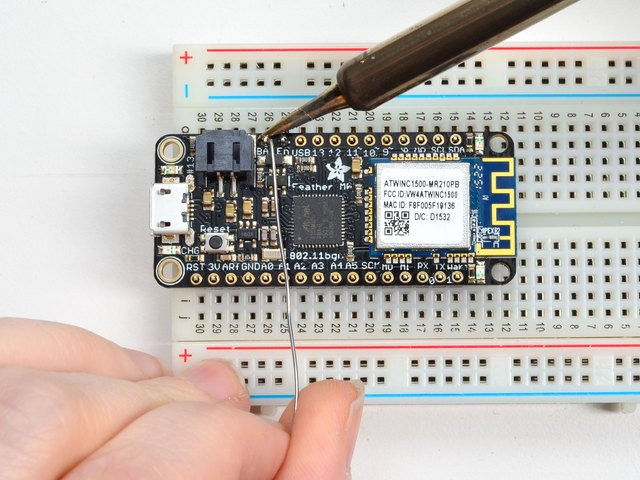

## Adafruit HUZZAH32 - ESP32 Feather

Es una excelente placa con un formato muy cómodo para trabajar con protoboard, que además incluye conector y cargador para batería Lipo

* 240 MHz dual core Tensilica LX6 microcontroller with 600 DMIPS
* 520 KB SRAM
* 802.11b/g/n HT40 Wi-Fi t
* Dual mode Bluetooth (classic and BLE)
* 4 MByte flash
* Hall sensor
* 10x capacitive touch interface
* 3 x UARTs 
* 3 x SPI 
* 2 x I2C 
* 12 x ADC de 12 bits
* 2 x I2S for Audio
* 2 x DAC de 10 bits

Conector JST para batería lipo, con cargador incorporado

Podemos leer el valor de la batería en A13/35. Debemos multiplicar por 2 el valor leído

Incorpora un led en la placa conectado al pin 13.

Tiene etiquetadas en placa los pines SDA y SCL conectados a los pines 22 y 23, que no es el estándar de facto en el mundo ESP.

Debemos soldar los pines

