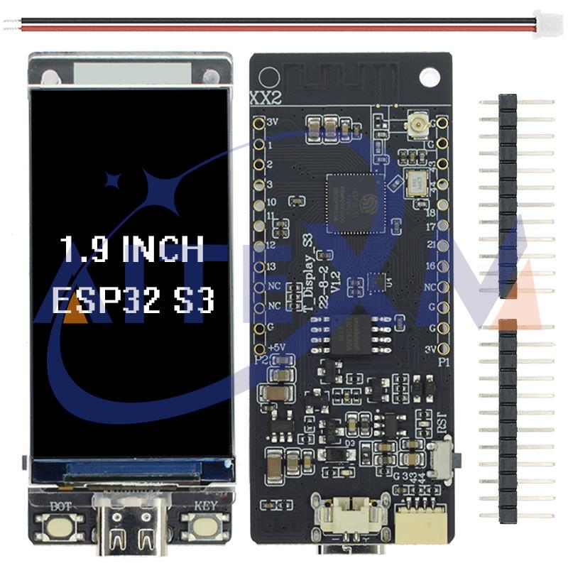
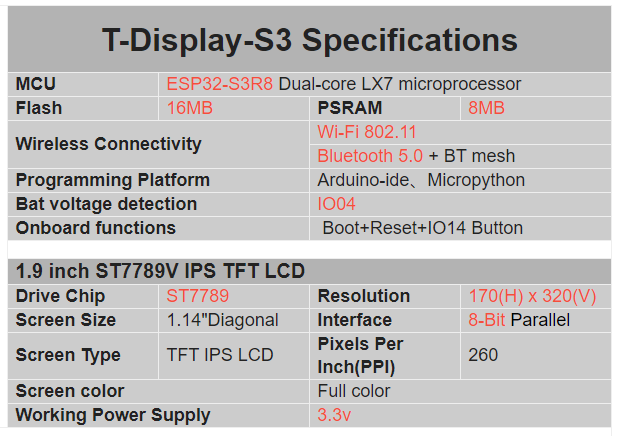
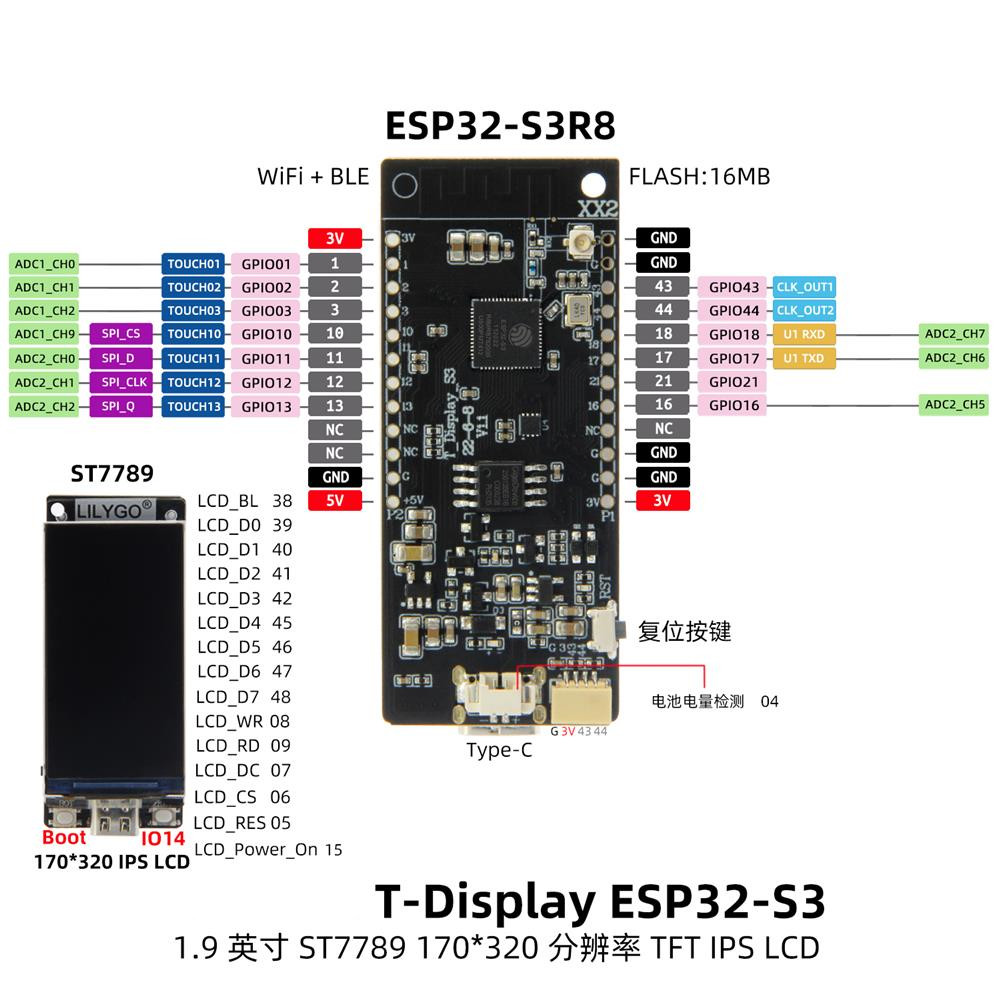
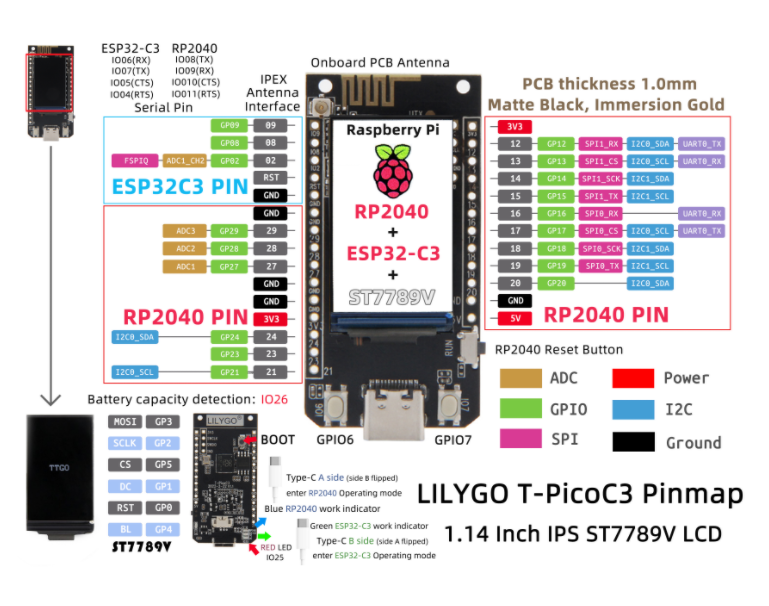
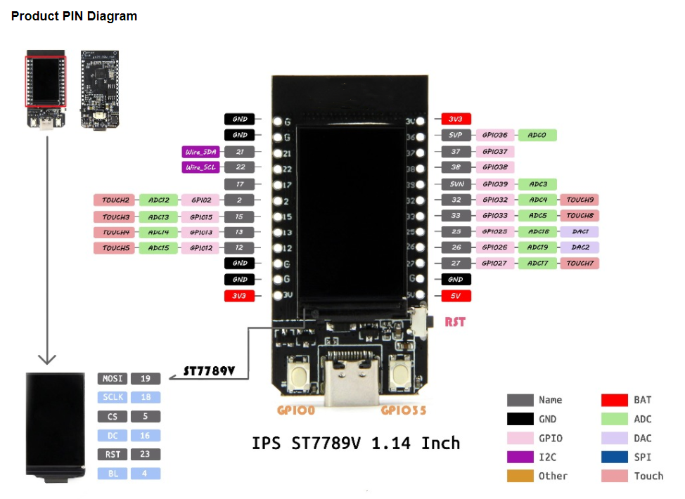
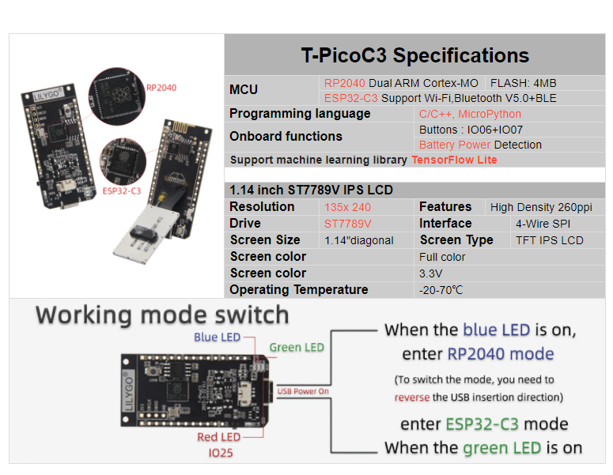

### ESP32 S3

### TTGO

https://es.aliexpress.com/item/1005003648478457.html?spm=a2g0o.order_detail.order_detail_item.3.39c339d3a35fKQ&gatewayAdapt=glo2esp

### TTGO T-Display

[Producto](https://es.aliexpress.com/item/1005004496543314.html)

Pantalla de 1.9"

El ESP32-S3 es una evolución del conocido ESP32, donde se han mejorado sus características:

Procesador: Dual core LX7

[Detalles del producto](https://github.com/Xinyuan-LilyGO/T-Display-S3)

## T-PicoC3

