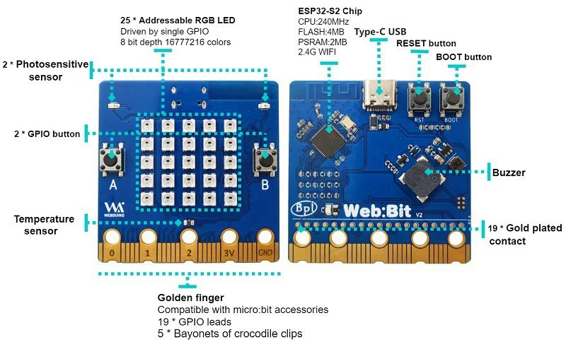
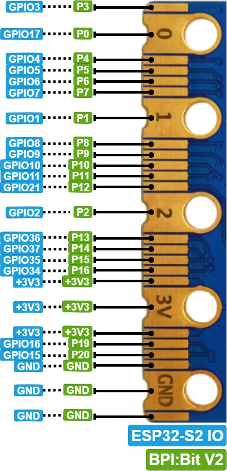

# Web:bit/BPI:bit

La Web:bit es una placa compatible a nivel de conexión con la placa micro:bit y que incluye un ESP32 S2, por tanto tiene un potente procesador, Wi-Fi, Bluetooth y además incluye 25 sensores RGB similares a la pantalla de la micro:bit pero totalmente con color RGB, dos botones y algunos sensores en la placa

Incluye:

* 25 LEDs RGB (Pin 18) 
* 2 LDRs  uno a cada lado en la parte de arriba
* 1 sensor de temperatura (termistor) sobre el agujero del pin 2
* 2 botones
* El conector es compatible con micro:bit

Peripheral |GPIO allocation|signal type
---|---|---
Photosensitive sensor(L)|	GPIO 12|Analog Input (13 bits)
Photosensitive sensor(R)|	GPIO 13	|Analog Input (13 bits)
Thermistor sensor|	GPIO 14	|Analog Input
Key A|	GPIO 38	|Digital Input
Key B|	GPIO 33	|Digital Input
Key BOOT|	GPIO 0|	Digital Input
Buzzer|	GPIO 17	|PWM (Digital Output)
RGB LEDs|	GPIO 18|	Digital Output

I2C/SPI|Pin conector|GPIO
---|---|---
SPI_SCK|	P13	|GPIO36
SPI_MISO|	P14	|GPIO37
SPI_MOSI|	P15	|GPIO35
SPI_CS|	P16	|GPIO34
I2C_SCL|	P19	|GPIO16
I2C_SDA|	P20	|GPIO15

Se puede programar con micropython o con [blockly](https://webbit.webduino.io/blockly/?demo=default&lang=en)

[Página del producto](https://wiki.banana-pi.org/BPI-Bit-S2)

[Esquema](https://github.com/BPI-STEAM/BPI-BIT-Lite-Doc/blob/main/sch/BPI-BIT-Lite-V0.2.pdf)

[Documentación](https://md.webduino.io/s/vjiZS5dmS)

[Documentación traducida](https://md-webduino-io.translate.goog/s/vjiZS5dmS?_x_tr_sl=es&_x_tr_tl=en&_x_tr_hl=es&_x_tr_pto=wapp)

