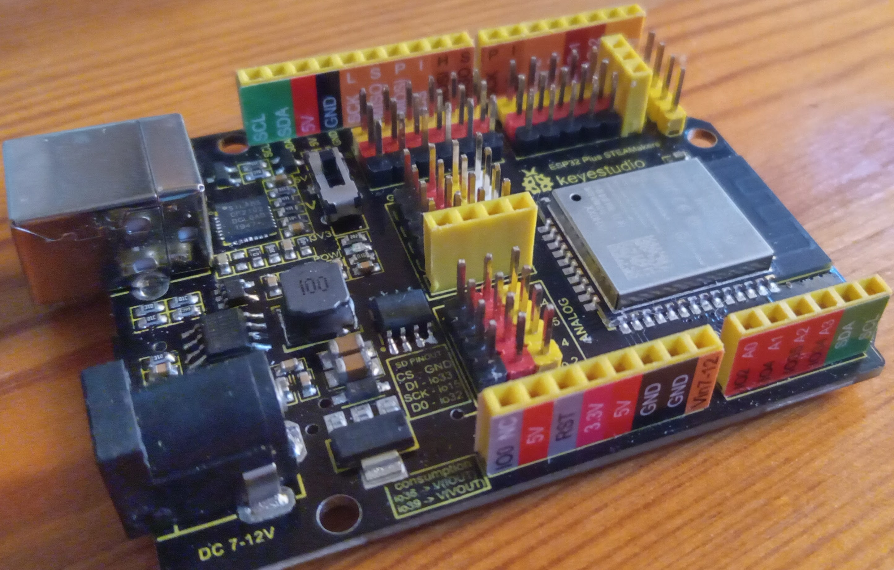
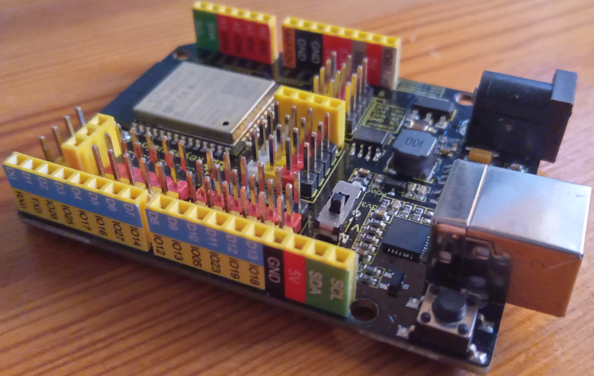
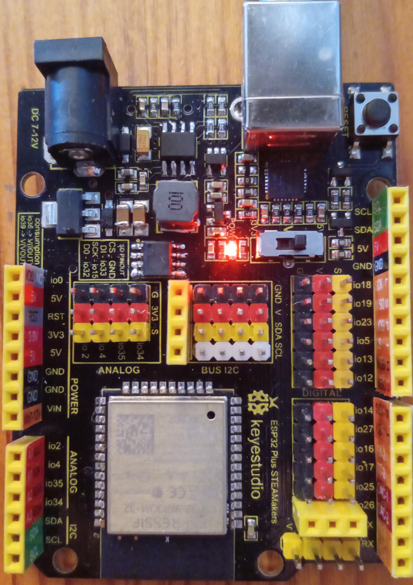
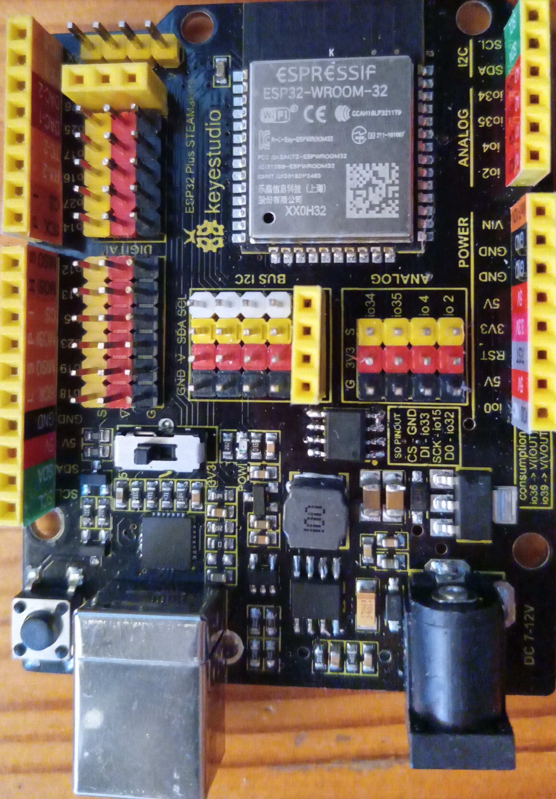
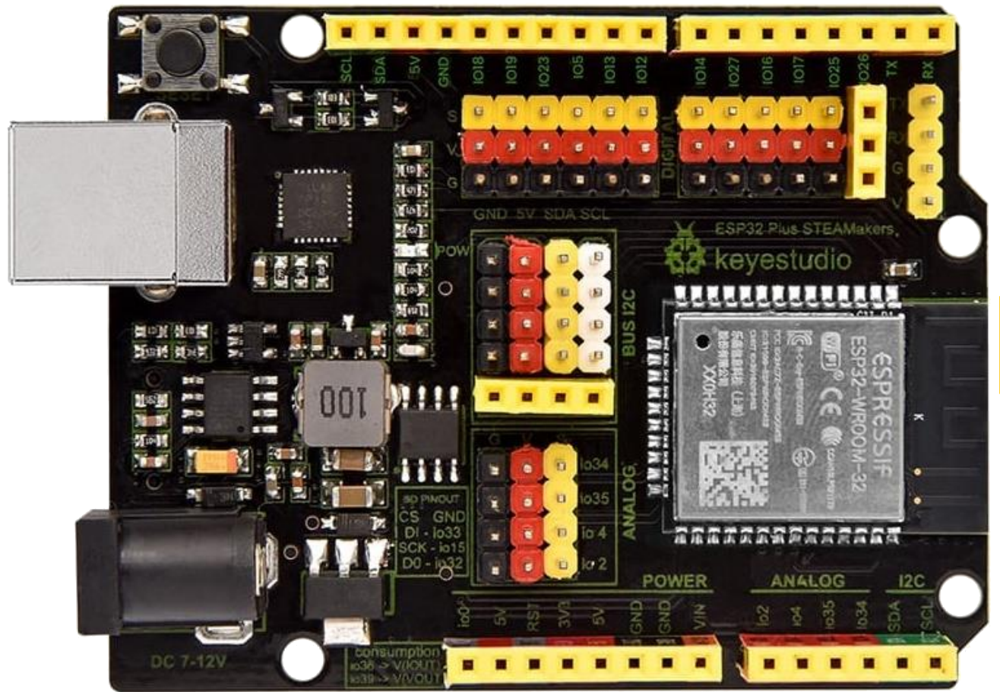
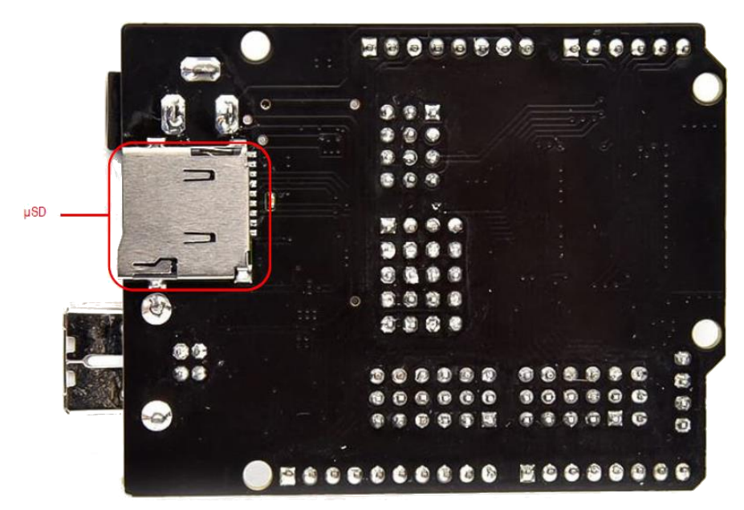
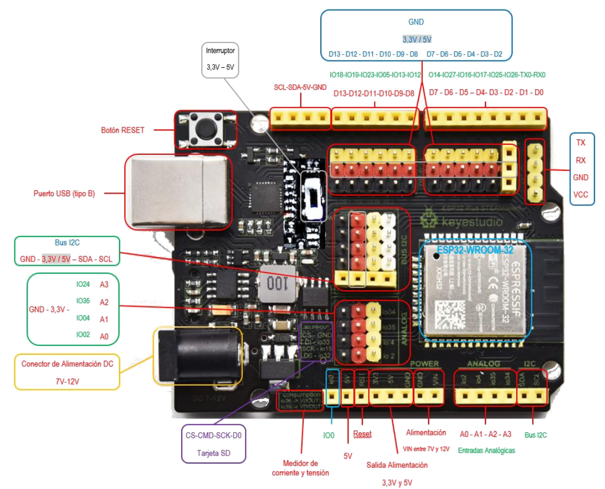

## ESP32 Plus STEAMakers

Esta placa [ESP32 STEAMAKERS](https://tienda.bricogeek.com/arduino-compatibles/1705-esp32-steamakers.html) es una versión muy completa de las ESP32 que conocemos.

Tiene formato Arduino UNO para así poder usar los shields/escudos que ya tengamos.

Además incluye un conector para tarjeta SD y permite medir su propio consumo.

Como vemos en las imágenes, dispone de conexión sencilla para sensores de tres pines.

Además se han desdoblado los pines I2C para facilitar la conexión de los dispositivos I2C cada vez más frecuentes.

### Características

Las características más importantes de esta placa son:

* Microcontrolador Tensilica Xtensa 32-bit LX6 a 160MHz.
* Conectividad Wifi 802.11 b/g/n/e/i.
* Conectividad Bluetooth 4.2 y modo BLE.
* Zócalo para tarjetas µSD.
* 14 entradas y salidas digitales con alimentación.
* Conector serie hembra con alimentación.
* Conector I2C para conectar hasta 5 dispositivos a la vez sobre la misma
placa.
* Conector hembra I2C para conexión de una pantalla OLED.
* Conector de Reset.
* Conector de 5V
* Conector de 3.3V
* Interruptor 3.3-5V seleccionable para cambiar entre estas dos tensiones
en algunos pines de alimentación.
* Entradas y salidas analógicas.
* Sensor Hall y de temperatura integrado.
* 2 convertidores Digital-Analógico (DAC) de 8 bits.
* 16 convertidores Analógico-Digital (ADC) de 12 bits.
* 16 canales PWM.
* 2 UART.
* 2 canales I2C.
* 4 canales SPI.
* 448Kb ROM.
* 520 KB SRAM.
* 8KB+8KB SRAM en RTC.
* 1kbit eFUSE.
* 512 bytes Memoria Flash (EEPROM).
* 10 sensores táctiles.
* 4 temporizadores internos de 64 bits.

Incluye un ACS712 conectado a los pines io39 para medida de voltaje e io36 para intensidad y así poder determinar el consumo en cada momento.
