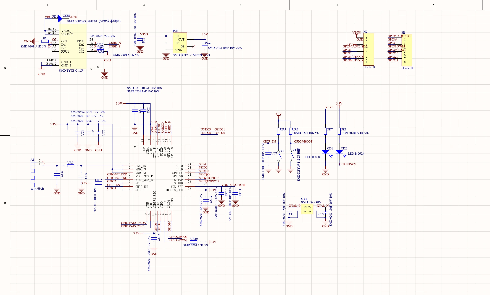
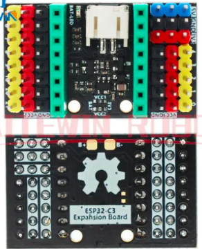
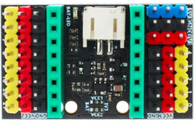
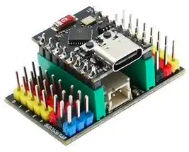

## ESP32-c3 SuperMini

* CPU: ESP32-C3. 32-bit RISC-V single-core processor,  up to 160 MHz
* Wifi + Bluetooth
* 400KB RAM
* 384KB ROM
* 4M flash
* 1 x I2C
* 1 x SPI
* 2 x UART
* 11 x GPIO (PWM)
* 4 x ADC
* Blue led on GPIO08

[firmware micropython](https://micropython.org/download/ESP32_GENERIC_C3/)

### Shield

