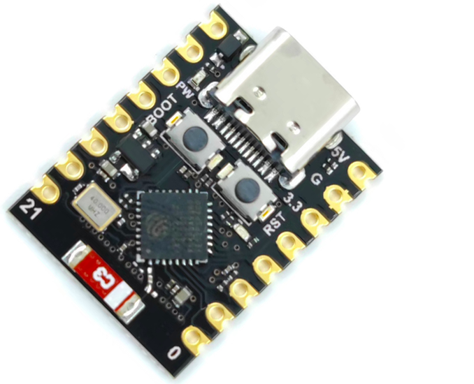
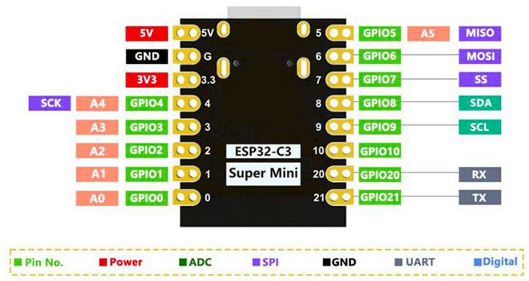

## ESP32-c3 SuperMini

CPU: ESP32-C3. 32-bit RISC-V single-core processor,  up to 160 MHz
Wifi + Bluetooth
400KB RAM
384KB ROM
4M flash
1xI2C
1xSPI
2xUART
11xGPIO (PWM)
4xADC
Blue led on GPIO08

[firmware micropython](https://micropython.org/download/ESP32_GENERIC_C3/)