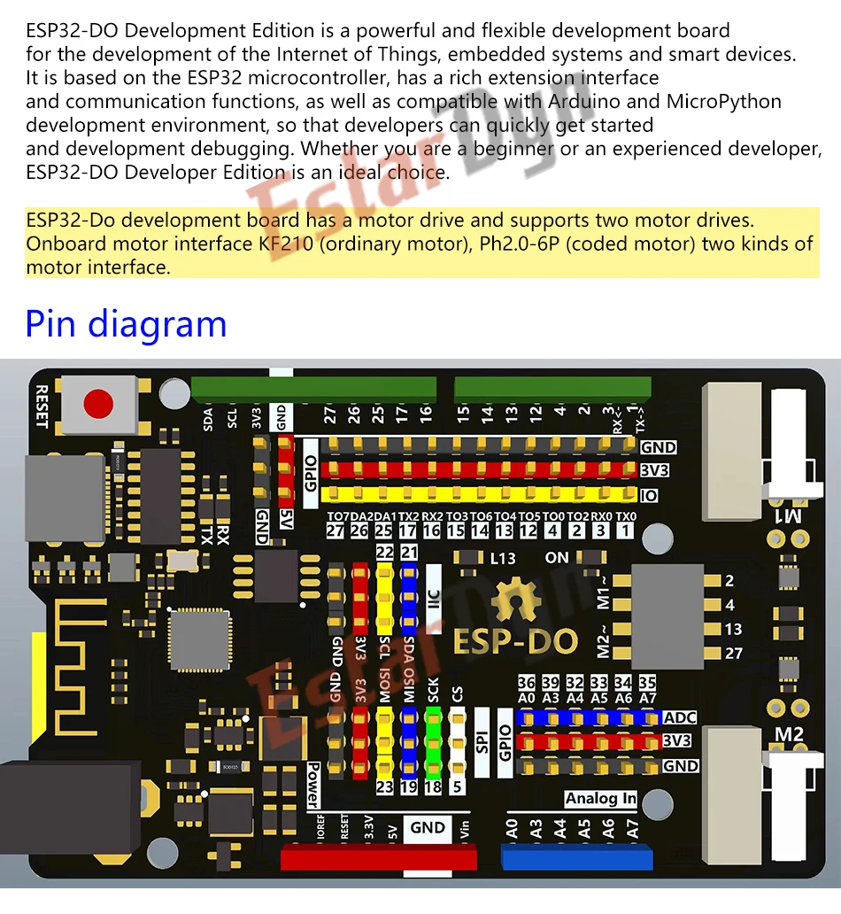
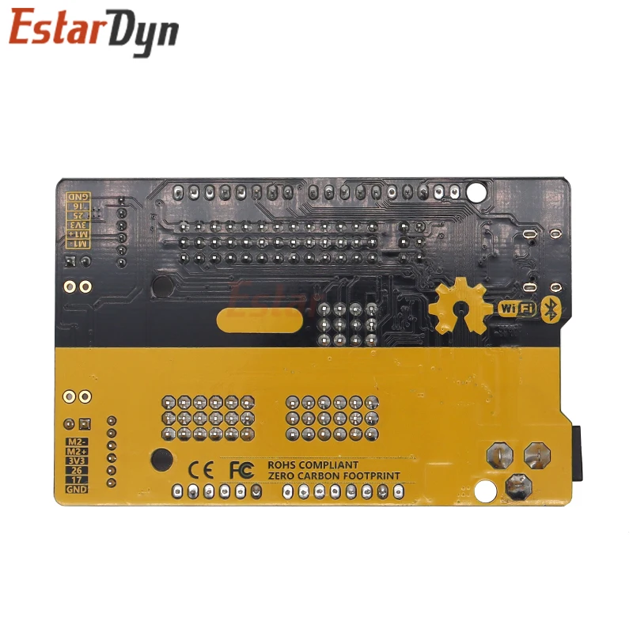
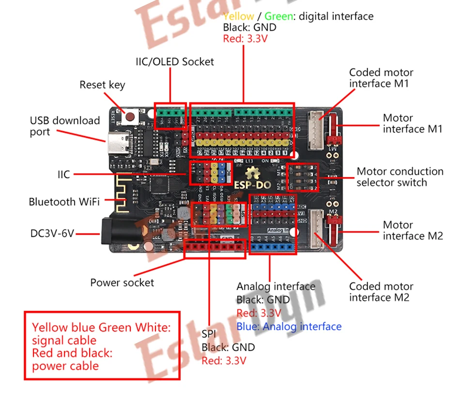
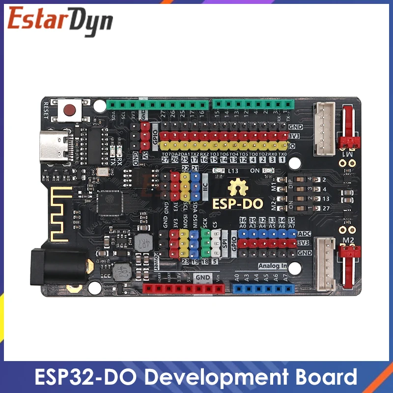

## ESP-D0

### Conector motores

[Encoder pololu para N20](https://www.pololu.com/blog/860/new-products-magnetic-encoder-pair-kit-with-jst-sh-type-connectors-for-micro-metal-gearmotors)

https://forum.dronebotworkshop.com/motors/5-pin-brushless-dc-gearmotor-control-vs-6-pin-encoder-for-dc-motor/