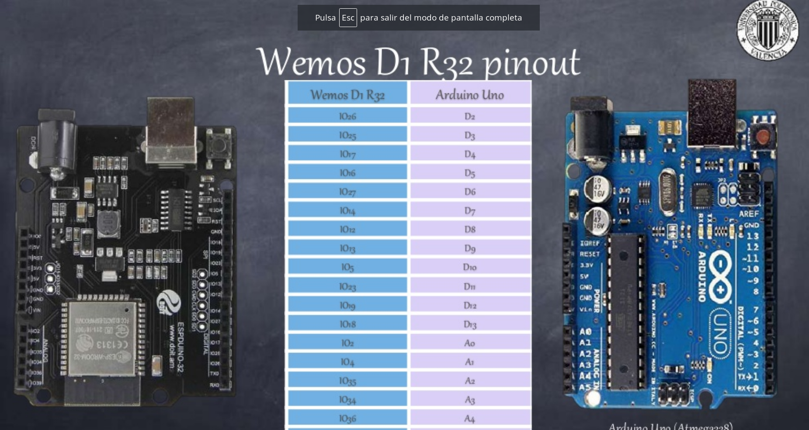

## Wemos D1 R32

Basado en ESP32 y con el formato de Arduino

# Pinout

LED_BUILTIN = 2

D2 = 26
D3 = 25
D4 = 17
D5 = 16
D6 = 27
D7 = 14
D8 = 12
D9 = 13
D10 = 5
D11 = 23
D12 = 19
D13 = 18
A0 = 2
A1 = 41
A3 = 34
A4 = 36
A5 = 39

# Extra 15, 33, 32 
# SD2, SD3, CMD, CLK, SD0, SD
# SDL,SDA

