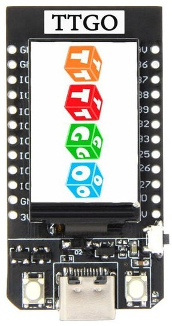

## TT-GO T-DISPLAY ESP32 LCD

Se trata de una placa basada en ESP32 que añade una pantalla gráfica OLED a color. Además tiene un formato bastante compacto y cómodo de usar con placas de prototipo estándar.

Estos son los detalles de la placa:

* 4 MB de memoria Flash
* 520Kb de RAM

Pantalla 1.14" OLED-color IPS ST7789V 1.14 pulgadas de 135 x 240 pixels. Conexión SPI:

* MOSI: 19
* SCLK: 18
* CS: 5
* DC: 16
* RST: 23
* Back Light: 4

Circuito de carga (500mA) y alimentación (1A) desde batería lipo que podemos conectar:

* Lectura del voltaje de la alimentación en pin 34
* Lectura de voltaje de la batería en pin 14

Dispone de 2 pulsadores que podemos usar libremente y de un pulsador de reset

* Botón 1: 35
* Botón 2: 0
