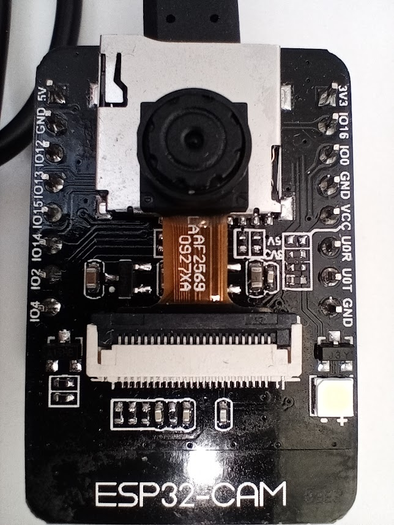

LED potente: pin 4
led rojo (back): pin 33 (invertido)

|Tarjeta SD|ESP32
|---|---
|CLK|	GPIO 14
|CMD|	GPIO 15
|DATA0|	GPIO 2
|DATA1 / flashlight|	GPIO 4
|DATA2|	GPIO 12
|DATA3|	GPIO 13

¿tantos pines? 
en micropython 
    'miso':2,
    'mosi':15,
    'ss':13,
    'sck':14,


Pines libres

https://github.com/Kmiz07/espcam2telegram

[micropython con camara para ESPCam](https://github.com/lemariva/micropython-camera-driver)

ejemplo sencillo

```python
# Ejemplo de uso de camara ESP-CAM
# https://github.com/lemariva/micropython-camera-driver
# from @lemariva

v = '0.1'

import camera
print('Inicializando camara')
camera.init(0, format=camera.JPEG)
print('Tamaño a '+camera.Frame_VGA)
camera.framesize(camera.FRAME_VGA)
'''
# special effects
camera.speffect(camera.EFFECT_NONE)
# The options are the following:
# EFFECT_NONE (default) EFFECT_NEG EFFECT_BW EFFECT_RED EFFECT_GREEN EFFECT_BLUE EFFECT_RETRO

# white balance
camera.whitebalance(camera.WB_NONE)
# The options are the following:
# WB_NONE (default) WB_SUNNY WB_CLOUDY WB_OFFICE WB_HOME

# saturation
camera.saturation(0)
# -2,2 (default 0). -2 grayscale 

# brightness
camera.brightness(0)
# -2,2 (default 0). 2 brightness

# contrast
camera.contrast(0)
#-2,2 (default 0). 2 highcontrast

# quality
camera.quality(10)
# 10-63 lower number means higher quality
'''
print('Capturando')
buf = camera.capture()
print('Capturado')
f = open('image.jpg','w')
print('Escribiendo')
f.write(buf)
f.close()
print('Terminado!!')


```

### Ejemplos

[Servidor web con streaming](https://github.com/lemariva/uPyCam)

[Time Lapse](https://github.com/lemariva/uPyCam/tree/timelapse-camera)

### Recursos

[Tutorial](https://lemariva.com/blog/2019/09/micropython-how-about-taking-photo-esp32)

[ESP32 CAM](https://www.banggood.com/custlink/GKmvayBgmP)

