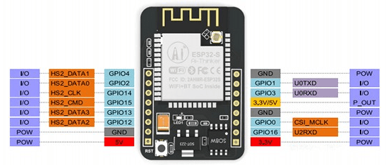

## ESP32 CAM

Como su nombre indica se trata de una placa con ESP32 que incorpora una cámara, un flash y un lector de tarjetas SD.

Al usar todos estos periféricos quedan pocos pines libres para otros usos

### Pines

* Flash (LED blanco potente): pin 4
* Led rojo (back): pin 33 (invertido)

|Tarjeta SD|ESP32
|---|---
|CLK|	GPIO 14
|CMD|	GPIO 15
|DATA0|	GPIO 2
|DATA1 / flashlight|	GPIO 4
|DATA2|	GPIO 12
|DATA3|	GPIO 13

