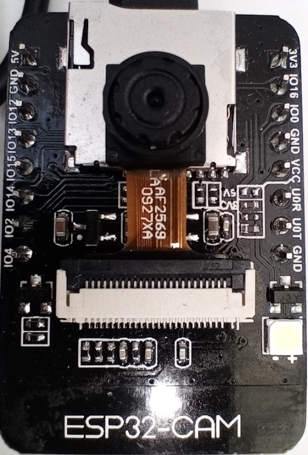

LED potente: pin 4
led rojo (back): pin 33 (invertido)

|Tarjeta SD|ESP32
|---|---
|CLK|	GPIO 14
|CMD|	GPIO 15
|DATA0|	GPIO 2
|DATA1 / flashlight|	GPIO 4
|DATA2|	GPIO 12
|DATA3|	GPIO 13

¿tantos pines? 
en micropython 
    'miso':2,
    'mosi':15,
    'ss':13,
    'sck':14,

