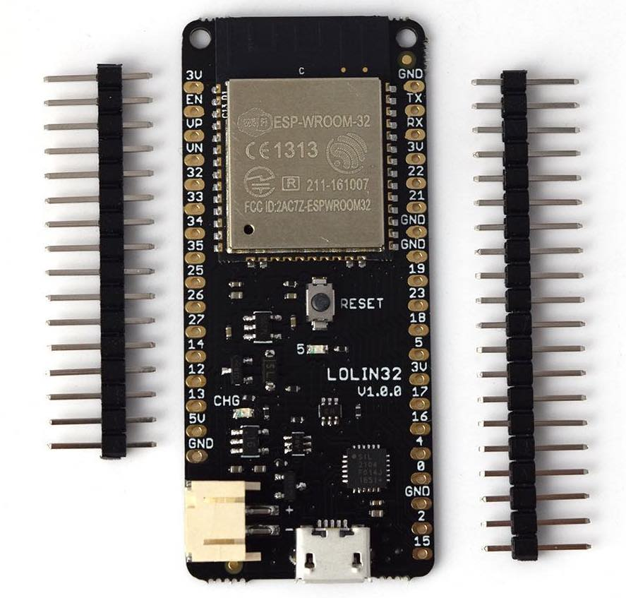
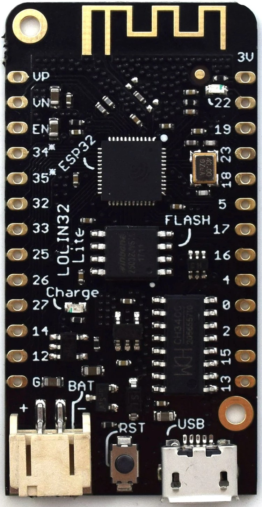
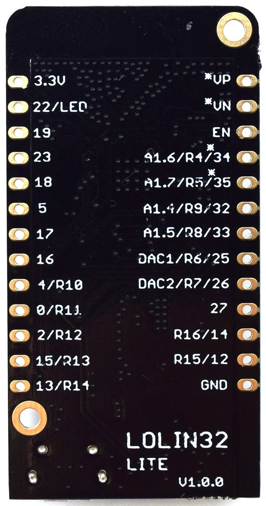

## Lolin32

Incluye conector JST de batería y cargador desde el USB

## Lolin32 Lite

Incluye conector JST de batería y cargador desde el USB

Personalmente me gusta que en la misma placa tenemos mucha información:
* LED_BUILTIN 22 (Invertido)
* Pines con la numeración de ESP32
* DAC pines 25 y 26

Incluye 4MB Flash

Tiene los mismos pines que su hermana mayor salvo 5V, Tx y Rx y algunas GNDs

¿Podemos saber el nivel de carga?

## ESP32 con OLED

[detalles](https://wiki.geekworm.com/WEMOS_ESP32_Board_with_OLED)

## Características

### [¿Cuánta memoria tiene mi ESP32?](https://stackoverflow.com/questions/39631011/how-to-determine-flash-size-of-nodemcu)

run esptool.py -p <serial-port> flash_id 

### [Cómo usar PSRAM](https://thingpulse.com/esp32-how-to-use-psram/)

### Lolin32

[Esquematico de Lolin32 ESP32](https://wiki.wemos.cc/_media/products:lolin32:sch_lolin32_v1.0.0.pdf)

