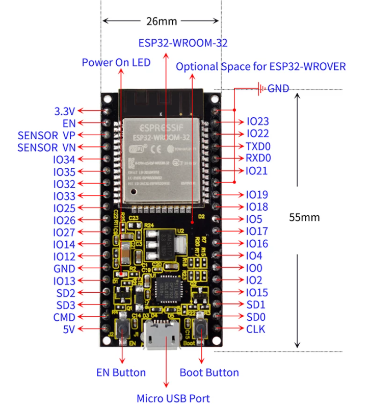
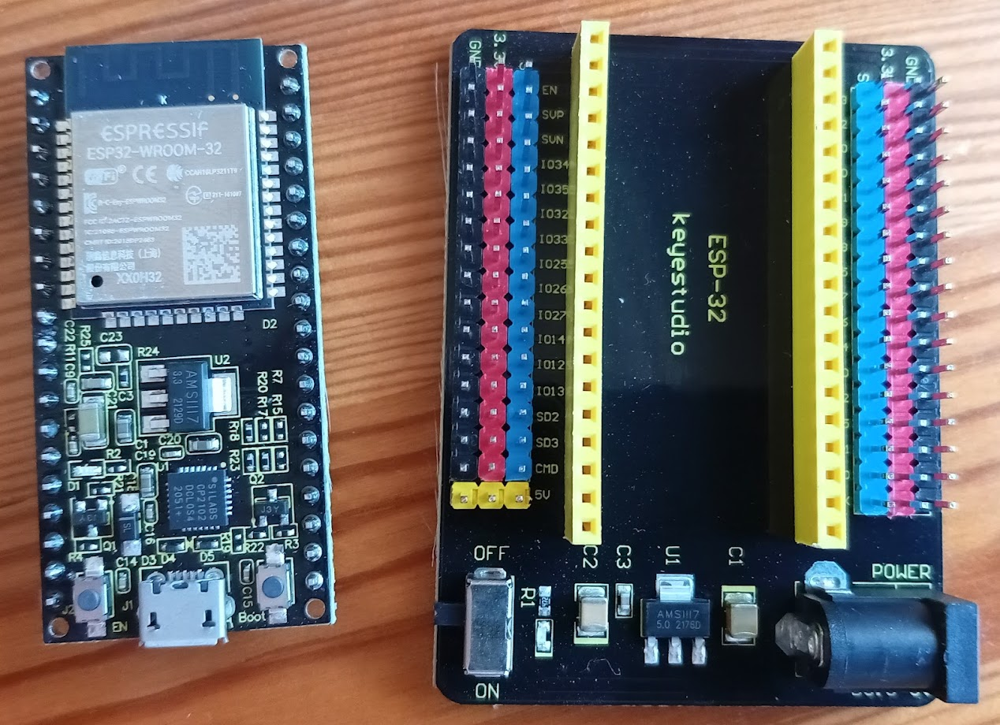
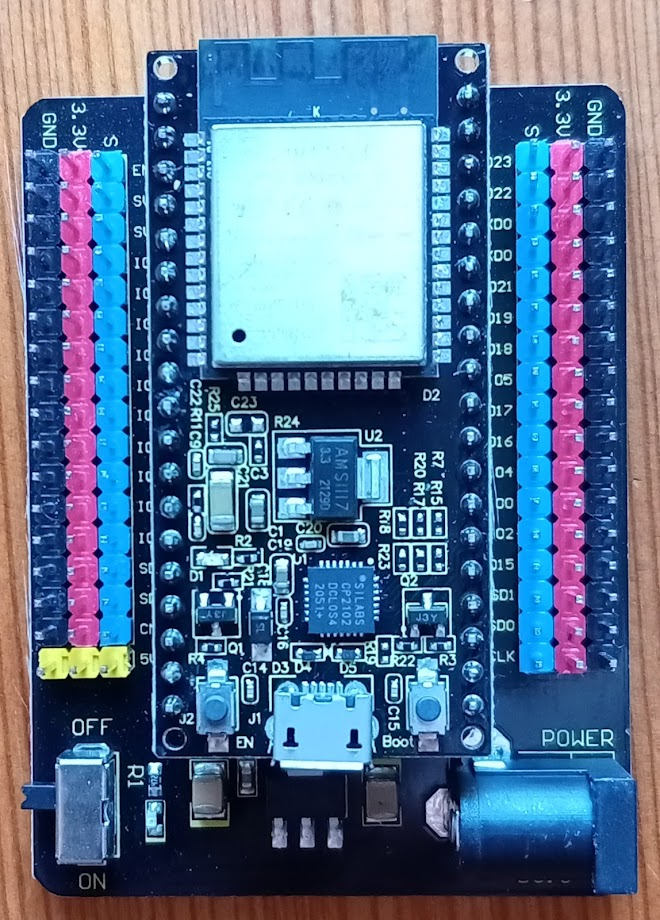

## ESP32-WROOM-32 de Keyestudio

Ventaja: ancho reducido que permite conectarlo a la protoboard

Shield para facilitar el montaje

[documentación ESP32](file:///home/javacasm/Descargas/KS0413%20Keyestudio%20ESP32%20Core%20Board%20(Black%20and%20Eco-friendly).pdf)

[documentación shield](file:///home/javacasm/Descargas/KS0465%20keyestudio%20ESP32-IO%20Shield.pdf)