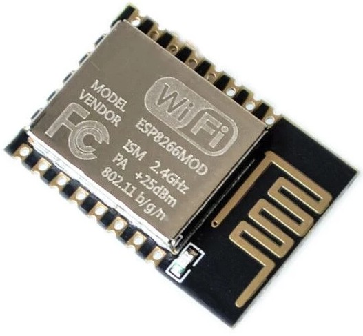

## ESP8266

Es el hermano pequeño del ESP32 y también es un SOC, aunque permite usar micropython, su menor memoria y CPU lo hacen adecuado para proyectos más pequeños

Incluye:

* Procesador de 32-bits a 80Mhz hasta 160Mhz   
* RAM de instrucciones de 32Kb
* RAM de datos de 80Kb
* Memoria flash de hasta 16Mb
* Wifi 
* 16 pines GPIO
* Funciona a 3.3V
* 1 ADC de 10 bits

Existe en varias versiones con diferentes encapsulado, como el ESP-12

