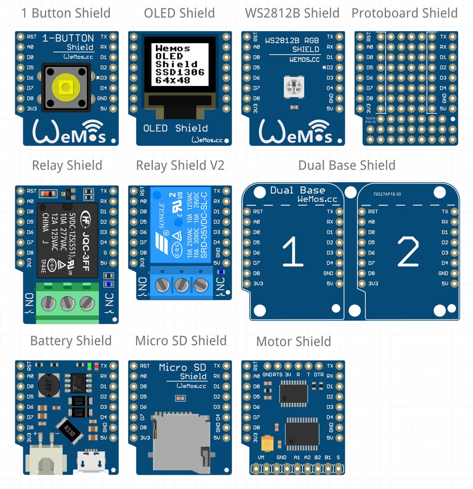

## Wemos D1 ESP8266

Basado en en el ESP8266 en formato ESP12, son una excelente colección de placas

El fabricante ha decidio renombrar los pines, para facilitar el uso podemos usar el módulo [Wemos.py](https://github.com/javacasm/micropythonTutorial/blob/master/codigo/Wemos.py) que nos permite usar los nombre de los pines que usa Wemos en lugar de los GPIO del ESP12 que utiliza micropython

### Módulos

Una de las grandes ventajas de usar Wemos es que el fabricante ha creado muchos módulos que podemos conectar como a la placa principal como escudos:

* Relé
* Distintos sensores de temperaturas, como DHT11, Ds18x20, TMP36,...
* Led RGB
* Pantallas gráficas
* ...

