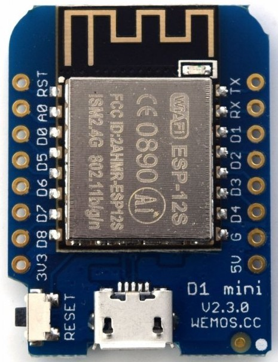

## Wemos D1 ESP8266

Basado en en el ESP8266 en formato ESP12

Para facilitar el uso de los pines usaremos el módulo [Wemos.py](https://github.com/javacasm/micropythonTutorial/blob/master/codigo/Wemos.py) que nos permite usar los nombre de los pines que usa Wemos en lugar de los GPIO del ESP12 que utiliza micropython

### Módulos

Rele
temperaturas

