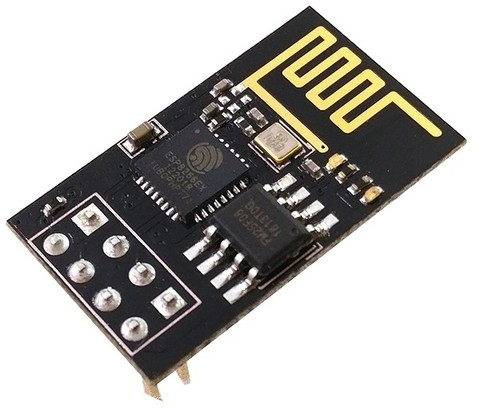

##  ESP8266 esp01 con micropython

Es la placa más pequeña del fabricante Espressif, ideal para proyectos con muy pocas necesidades. 

Sólo tiene 4 pines disponibles:

* GPIO0
* GPIO2
* TX
*RX

No dispone de USB, con lo que necesitamos un adaptador USB/serie para reprogramarlo.

## Módulos para ESP01

Existen diversos módulos que podemos conectar al ESP01 a los que sólo nos falta conectar alimentación:

* [Módulo con relé](https://www.instructables.com/ESP0101S-RELAY-MODULE-TUTORIAL/) (Relé en GPIO00)

* [Módulo con DHT11](https://www.makerfabs.com/esp-01-dht11-module.html) (DHT11 en GPIO02)

