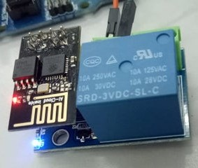
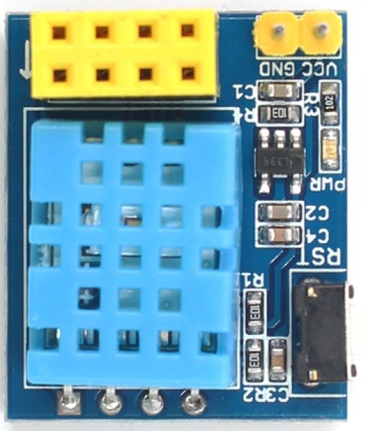

##  ESP8266 esp01 con micropython

GPIO0
GPIO2
TX
RX

## Módulos

[Módulo con rele](https://www.instructables.com/ESP0101S-RELAY-MODULE-TUTORIAL/)

Relé en GPIO00

[Módulo con DHT11](https://www.makerfabs.com/esp-01-dht11-module.html)

DHT11 en GPIO02

