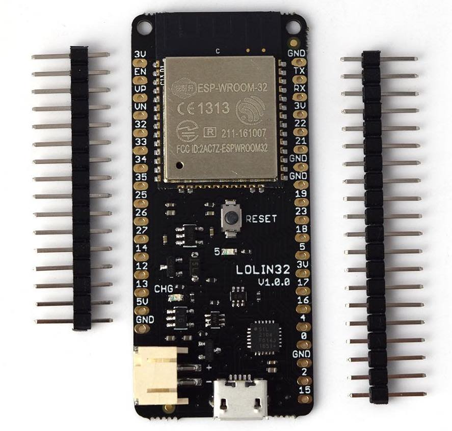
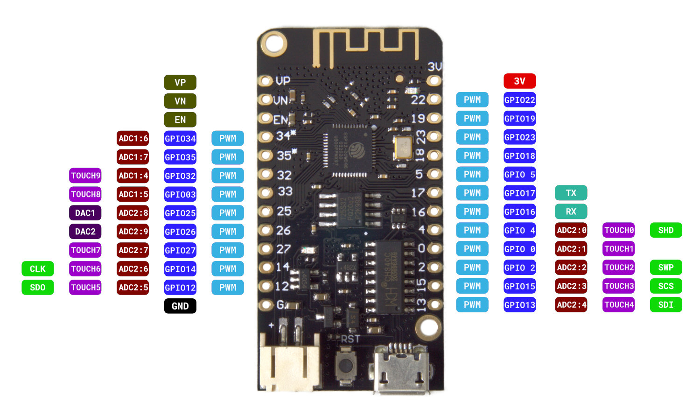
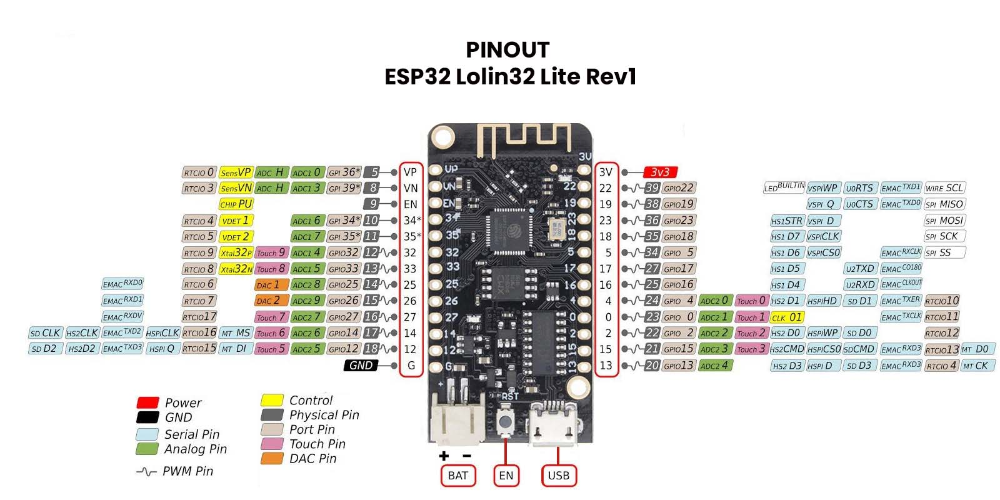

# Hardware compatible con micropython

[Modelos de ESP32](https://www.espressif.com/en/products/modules)

## Wemos D1 R32

Basado en ESP32 y con el formato de Arduino

## Wemos ESP32 battery

* Led incorporado el pin GPIO16 (¿D0?)

Pensado para incluir una batería LiPo 18650, incluye el cargador desde el USB
* Led verde indica que la batería está cargada y rojo que se está cargando

Pinout

(Imágenes cortesía de [geekworm](https://wiki.geekworm.com/WEMOS_ESP32_Board_with_18650_Battery_Holder)

PRO: 
* No incluye led de power para evitar consumos y aumentar la autonomía

## Lolin32

Incluye conector JST de batería y cargador desde el USB

## Lolin32 Lite

Incluye conector JST de batería y cargador desde el USB

LED_BUILTIN 22 (Invertido)
4MB Flash

Tiene los mismos pines que su hermana mayor salvo 5V, Tx y Rx y algunas GNDs

¿Podemos saber el nivel de carga?

## Características

### [¿Cuánta memoria tiene mi ESP32?](https://stackoverflow.com/questions/39631011/how-to-determine-flash-size-of-nodemcu)

run esptool.py -p <serial-port> flash_id 

### [Cómo usar PSRAM](https://thingpulse.com/esp32-how-to-use-psram/)