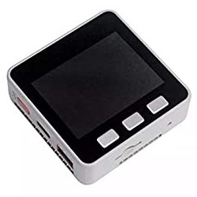

## Familia M5Stack

Son una familia de dispositivos con un acabado profesional, que además incluyen en el empaquetado varios dispositivos integrados de serie, como la pantalla color, botones, buzzer, lector de tarjeta SD, batería,...

Utilizan ESP32 como base, pero se merecen un apartado en sí mismo puesto que han construido un ecosistema de productos muy completos.

También existen complementos que integramos con toda facilidad y que amplían las posibilidades del equipo.

Están pensados para el desarrollo rápido de prototipos funcionales, pero con un acabado profesional.

El fabricante M5Stack libera los diseños y el código de sus firmwares además de apoyar a la comunidad Open Source con herramientas.

Existen dispositivos de distintos tamaños y capacidades.

