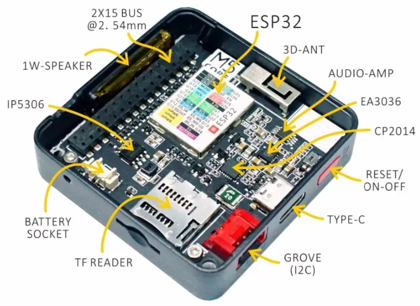
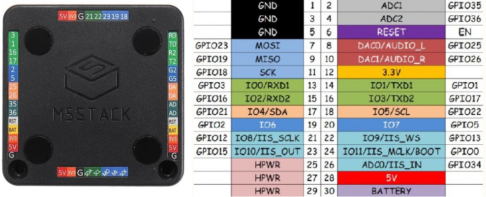
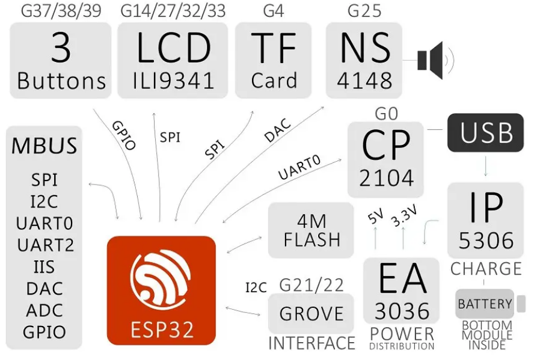

## m5Stack Core

Es el más básico:

## Características

* ESP32: 240 MHz de doble núcleo
* Flash de 16 MByte + 520K RAM
* Batería: 150 mAh a 3,7 V
* Lector de Tarjetas SD: de hasta 16Gb
* Wi-Fi 802.11b / g /  y Bluetooth
* MPU6886 + BMM150 (acelerómetro)
* Altavoz 
* 3 botones 
* LCD: 2 pulgadas, 320x240 Colorful TFT LCD, ILI9341
* Puerto de Grove
* M-Bus Enchufe y pines

Tamaño: 54 x 54 x 12,5 mm

El fabricante ha desarrollado muchos módulos que podemos conectar muy fácilmente, como controladores de motores, de servos, ....

