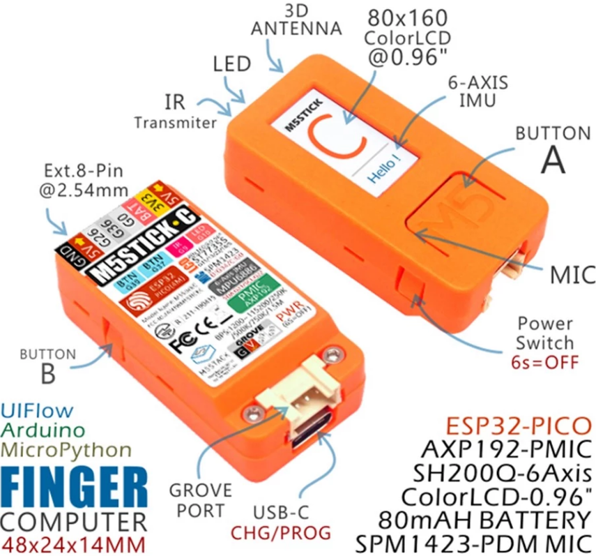
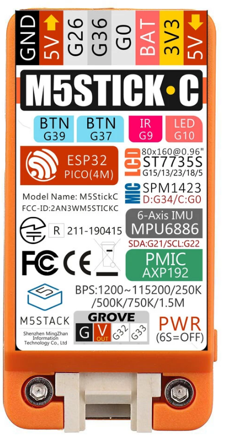

## M5Stick-C 

A pesar de su pequeño tamaño (42x24x14mm), el M5Stick añade a un potente ESP32, una cantidad enorme de dispositivos

## Características

* Fuente de alimentación de 5V CC
* USB tipo-C
* Basado en el desarrollo de ESP32: 
    * 802.11b/g/n HT40 Wi-Fi
    * Bluetooth BLE
    * Sensor Hall
* 4 MByte Flash + 520K RAM
* IMU de 6 ejes MPU6886/SH200Q
* LED rojo
* Micrófono
* 2 x Botones 
* LCD (0,96 pulgadas)  80 * 160 : ST7735S
* Botón de encendido/reinicio 
* 2,4G antena: Proant 440
* 80 mAh batería de litio
* Conector Grove

### GPIO de los dispositivos

|ESP32|pin|
|---|---|
|Led rojo|GPIO10
|Ir|GPIO09
|Boton A|GPIO37
|Boton B|GPIO39

|TFT LCD |ESP32	
|---|---	
|TFT_MOSI|	GPIO15
TFT_CLK|	GPIO13	
TFT_DC|	GPIO23	
TFT_RST|	GPIO18	
TFT_CS|  GPIO5

|PUERTO GROVE|GPIO
|---|---
SCL |GPIO33
SDA |	GPIO32

|MIC (SPM1423)|GPIO
|---|---
|SCL|	GPIO0
SDA|	GPIO34

IMU 6 ejes (MPU6886)|GPIO
---|---
PMU - gestion  energía (AXP192)|GPIO
SCL|GPIO22
SDA|	GPIO21

RTC - BM8563

## Conector de 5 pines

* 0: ADC, PWM, touch, conectado al micrófono
* 26: ADC, PWM, DAC
* 32: ADC, PWM, touch, I2C, on the Grove connector
* 33: ADC, PWM, touch, I2C, on the Grover connector
* 36: ADC, PWM, input only,  has the ESP’s hall effect sensor connected to it.
