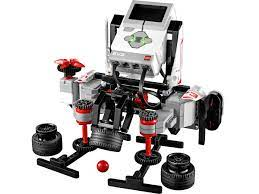

## Lego ev3 micropython (EV3Dev)

ev3dev is a Debian Linux-based operating system that runs on several LEGO® MINDSTORMS compatible platforms including the LEGO® MINDSTORMS EV3 and Raspberry Pi-powered BrickPi.

[ev3dev ](https://www.ev3dev.org/)

[Descargas](https://www.ev3dev.org/downloads/)

Descargamos el firmware en una tarjeta SD desde la que se arranca, con lo que no hay que tocar el firmware original

[Tutoriales](https://www.ev3dev.org/docs/tutorials/)

[Complemento ev3 para Thonny](https://www.ev3dev.org/downloads/)

[Learn ev3 python](https://sites.google.com/site/ev3python/learn_ev3_python/workflows)

[ev3 simulator](https://github.com/ev3dev-python-tools/ev3dev2simulator)

https://education.lego.com/en-us/support/mindstorms-ev3/python-for-ev3

[Tutorial](https://le-www-live-s.legocdn.com/sc/media/files/ev3-micropython/ev3micropythonv100-71d3f28c59a1e766e92a59ff8500818e.pdf)

