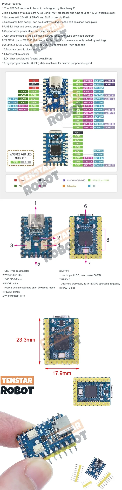
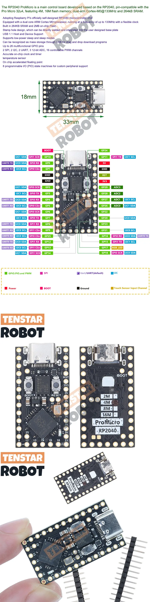

# RP2040 Raspi-clones

Ya existen en el mercado multitud de placas creadas sobre el micro RP2040

[micro RP2040](https://es.aliexpress.com/item/1005006094343216.html?spm=a2g0o.order_list.order_list_main.107.4052194dbv5x6l&gatewayAdapt=glo2esp)

Product teatures
1. The RP2040 microcontroller chip is designed by Raspberry Pi
2.It is powered by a dual-core ARM Cortex M0+ processor and runs at up to 133MHz flexible clock
3.It comes with 264KB of SRAM and 2MB of on-chip Flash
4.Real stamp hole design, can be directly welded into the self-designed base plate
5.USB1.1 host and device support
6.Supports low power sleep and hibernation modes
7.Can be identified by USB as mass storage for support type download program
8.29 GPI0 pins of RP2040 (20 can be led by row pins, the rest can only be led by welding)
9.2 SPIs. 2 12Cs. 2 UART. 4 12-bit ADC. 16 controllable PWM channels
10 Accurate on-chin clock and time
11.Temperature sensor
12.On-chip accelerated floating point library
13.Eight programable I/0 (PIO) state machines for custom peripheral

O [esta otra](https://es.aliexpress.com/item/1005006130019224.html?spm=a2g0o.order_list.order_list_main.101.4052194dbv5x6l&gatewayAdapt=glo2esp)

