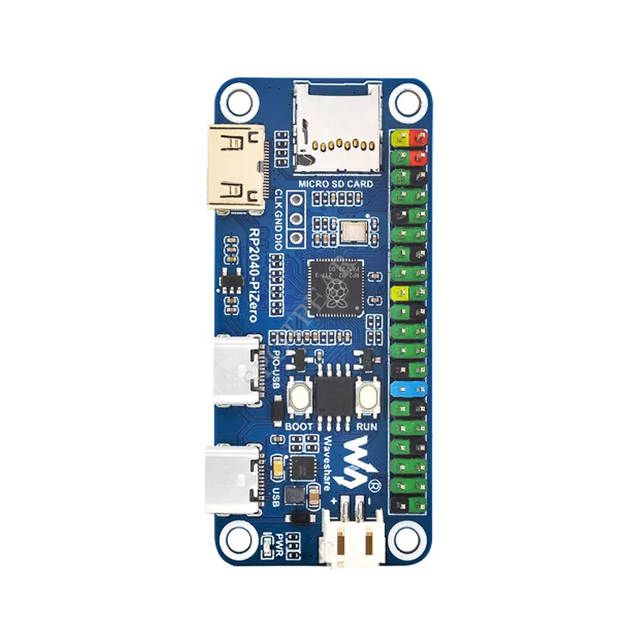
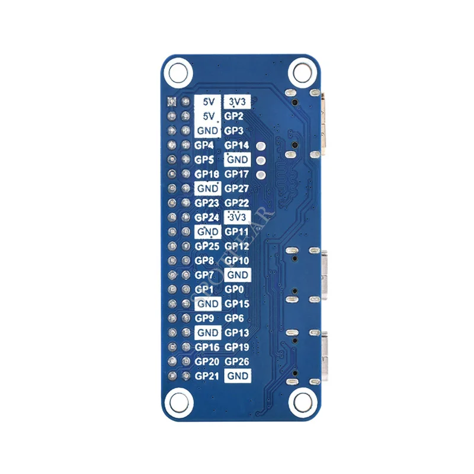
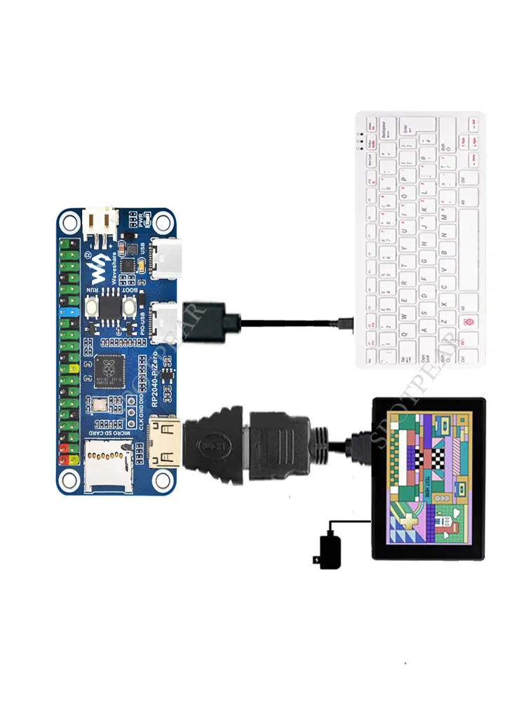

## RP2040

Placa basada en el micro RP2040 con formato Raspberry Pi Zero, con tarjeta SD, USB, batería y salida HDMI

Programable en C, arduino y micropython

[PicoDVI: HDMI en C](https://github.com/Wren6991/PicoDVI)

Para usar HDMI o USB se necesita C, aunque [hay un hack para micropython](https://github.com/Wren6991/micropython/tree/dvi-vt100) (usa un core para micropython y otro para HDMI, perdemos la escritura en flash)

* RP2040 microcontroller chip designed by Raspberry Pi in the United Kingdom
* Dual-core ARM Cortex M0+ processor, flexible clock running up to 133 MHz
* 264KB of SRAM, and 16MB of onboard Flash memory
* Onboard DVI interface can drive most HDMI screens (DVI compatibility required)
* Supports using as a USB host or slave via onboard PIO-USB port
* Onboard TF card slot for reading and writing TF card
* Onboard Lithium battery recharge/discharge header, suitable for mobile scenarios
* USB 1.1 with device and host support
* Drag-and-drop programming using mass storage over USB
* Low-power sleep and dormant modes
* 2 × SPI, 2 × I2C, 2 × UART, 4 × 12-bit ADC, 16 × controllable PWM channels
* Accurate clock and timer on-chip
* Temperature sensor
* Accelerated floating-point libraries on-chip
* 8 × Programmable I/O (PIO) state machines for custom peripheral support

[Documentación](https://www.spotpear.com/index/study/detail/id/1138.html)

[Código](http://cdn.static.spotpear.com/uploads/picture/learn/raspberry-pi/rpi-pico/rp2040-pizero/RP2040-PiZero-Code-1.zip)

[Esquema electrónico](http://cdn.static.spotpear.com/uploads/picture/learn/raspberry-pi/rpi-pico/rp2040-pizero/RP2040-PiZero.pdf)