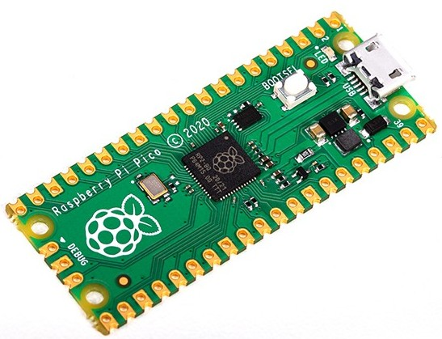
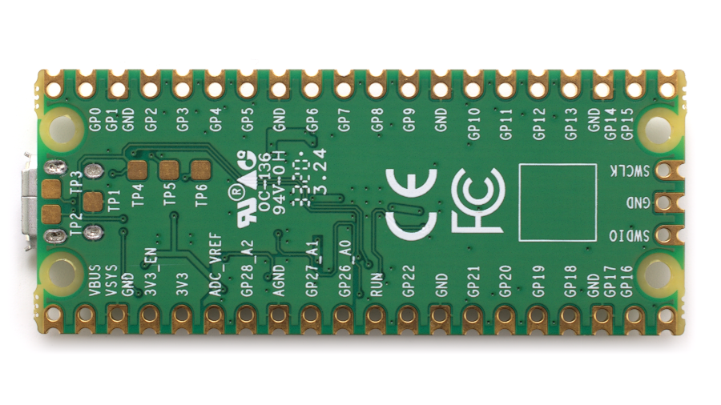
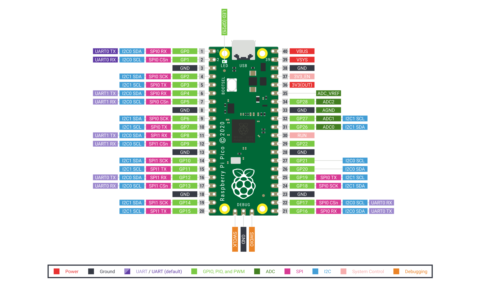

## Raspberry Pi Pico

Raspberry Pi Pico es un microcontrolador creado por la fundación Raspberry Pi. Tiene 2 cores Arm Cortex M0+ que se ejecutan hasta los 133MHz, con 264KB of RAM y  2Mb de almacenamiento flash y sólo cuesta 4$.

Por su tamaño y potencia podemos compararlo con el ESP32 y con algunas de las placas más potentes de Arduino, si la comparamos por precio sólo quedaría el ESP32, pero por prestaciones el ESP32 sólo con su Wifi y Bluetooth ya la deja totalmente atrás. Recomiendo la [comparativa de Andreas Spiess con ESP32 y otras placas](https://www.youtube.com/watch?v=cVHCllbN3bQ)

En cualquier caso me parece una apuesta muy valiente de la Fundación Raspberry Pi, que saca en su primera versión un producto muy digno y a un precio totalmente alucinante y que sin duda será una nueva revolución en el sector.

## Pines/Pinout

* 30 GPIO
* 3 entradas analógicas
* 16 canales PWM aplicable sobre cualquier pin
* 2 I2C
* 2 UARTs
* 2 SPI

Imagen de Hackter.io

