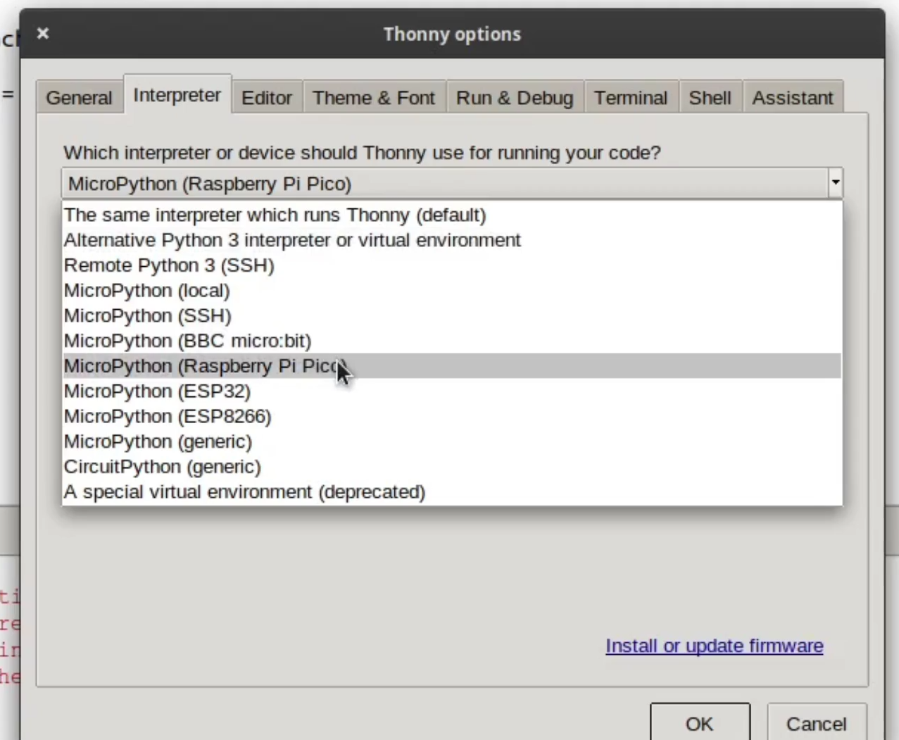
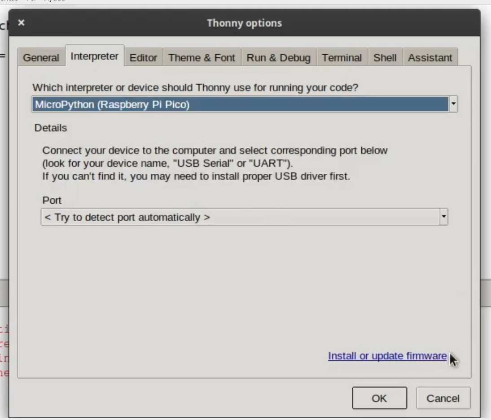
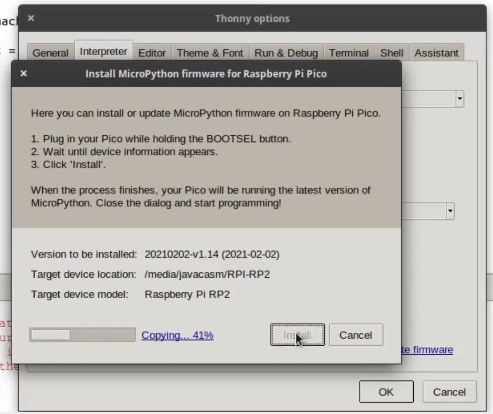

## Raspberry Pi Pico


Imagen de Hackter.io

Raspberry Pi Pico es un microcontrolador creado por la fundación Raspberry Pi. Tiene 2 cores Arm Cortex M0+ que se ejecutan hasta los 133MHz, con 264KB of RAM y  2Mb de almacenamiento flash y sólo cuesta 4$.

Por su tamaño y potencia podemos compararlo con el ESP32 y con algunas de las placas más potentes de Arduino, si la comparamos por precio sólo quedaría el ESP32, pero por prestaciones el ESP32 sólo con su Wifi y Bluetooth ya la deja totalmente atrás. Recomiendo la [comparativa de Andreas Spiess con ESP32 y otras placas](https://www.youtube.com/watch?v=cVHCllbN3bQ)

En cualquier caso me parece una apuesta muy valiente de la Fundación Raspberry Pi, que saca en su primera versión un producto muy digno y a un precio totalmente alucinante y que sin duda será una nueva revolución en el sector.

## Pines/Pinout

* 30 GPIO
* 3 entradas analógicas
* 16 canalles PWM aplicable sobre cualquier pin
* 2 I2C
* 2 UARTs
* 2 SPI


Imagen de Hackter.io


Imagen de RaspberryPi.org

Puedes usar el [módulo de frintzing de la Raspi Pico](https://datasheets.raspberrypi.org/pico/Pico-R3-Fritzing.fzpz) y [su esquema](https://datasheets.raspberrypi.org/pico/Pico-R3-A4-Pinout.pdf) de la [página de raspberry.org](https://www.raspberrypi.org/documentation/pico/getting-started/)

Más [detalles en la página de hackter.io](https://www.hackster.io/news/hands-on-with-the-rp2040-and-pico-the-first-in-house-silicon-and-microcontroller-from-raspberry-pi-effc452fc25d).

#### Uso micropython

El entorno de programación para micropython es Thonny que podemos instalar fácilmente desde [su página](https://thonny.org/) o desde python con 

```sh
pip3 install thonny
```

Debemos asegurarnos de usar la última versión (al menos la 3.3.3), con lo que si ya lo tenemos instalado debemos actualizarlo con 

```sh
pip3 install --upgrade thonny
```

En este vídeo vemos los primeros pasos

[](https://youtu.be/ttwo53KDqII)

[Vídeo: primeros pasos con Raspberry Pi Pico en micropython](https://youtu.be/ttwo53KDqII)

Ahora vamos a instalar el firmware de micropython a la Raspberry Pi Pico.

* Seleccionamos el intérprete de python adecuado desde el menú Run->Select Interpreter


Seleccionando "Micropython(Raspberry Pi Pico)



Desde esta opción tendremos acceso a la instalación del firmware
(Dejamos la opción de seleccion automática del puerto de conexión)



Pulsamos "Install or update firmware"

En la ventana que aparece veremos que se detecta la placa 


y pulsamos Install



Después de instalarse el firmaware se resetea la placa


Una vez instalado el firmware de micropython y tras pulsar la tecla **Enter** aparecerá la descripción del firmware instalado y el prompt de python ">>>" 


### Primera prueba: Hola Mundo

Escribimos nuestra pequeña prueba para ver que funciona el intérprete

```python
print('Hola Mundo')
```


### Ejemplo 1: Led On/Off

Vamos a probar ahora con un ejemplo para encender y apagar el led incluído en la Pico, que está conectado al pin 25

```python
import machine # Todo lo relaciionado con el acceso al hardware

# Creamos un objeto led conectado al pin 25 y como salida
led = machine.Pin(25, machine.Pin.OUT)

led.on() # Encendemos
led.off() # Apagamos
```

### Ejemplo 1.5: Parpadeo de led

Ahora introducimos un retardo y tenemos un led parpadeante. Para ello añadimos el módulo **utime**, una versión reducida del clásico módulo **time**. En micropython algunos módulos llevan una "u" (por la letra griega μ/micro) delante del nombre para indicar que son versiones reducidas 


```python
import machine # Todo lo relacionado con el acceso al hardware
import utime   # utilidades relacionadas con el tiempo

# Creamos un objeto led conectado al pin 25 y como salida
led = machine.Pin(25, machine.Pin.OUT)

while True:
    led.on()
    utime.sleep(0.5)
    led.off()
    utime.sleep(0.5)    

```
