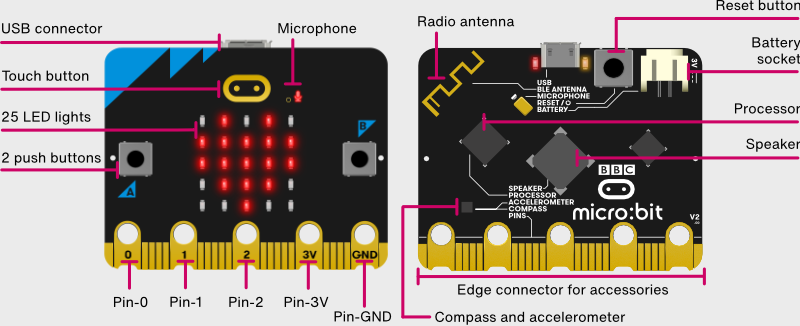

## micro:bit

micro:bit es una placa creada por la [Fundación microbit](http://microbit.org/es/) con el fin de que los niños aprendan a programación y robótica en la escuela, si bien es muy potente y permite su programación con diferentes leguajes como C++ (como Arduino), javascript o Python.

[Microbit es totalmente Open Source](https://www.microbit.co.uk/open_source). Podemos encontrar todos los detalles en el [Github de microbit](https://github.com/bbcmicrobit)

Funciona a 3V y dispone de un conector de batería y de alimentación por USB (MicroUSB)

Su micro es un Nordic nRF52833, ARM M4 (32 bits) a 64MHz con 128k de RAM y 512Kb de flash ROM

En su pequeño encapsulado incluye multitud de [sSensores](https://microbit.org/guide/features/) y complementos:

* Acelerómetro
* Brújula
* 2 Botones y uno táctil
* 6 entradas analógicas de 10 bits
* 20 pines I/O
* 25 (5x5) leds programables individualmente
* Bluetooth 5.1
* Sensor de temperatura
* Sensor de luz
* Pequeño altavoz
* Micrófono

