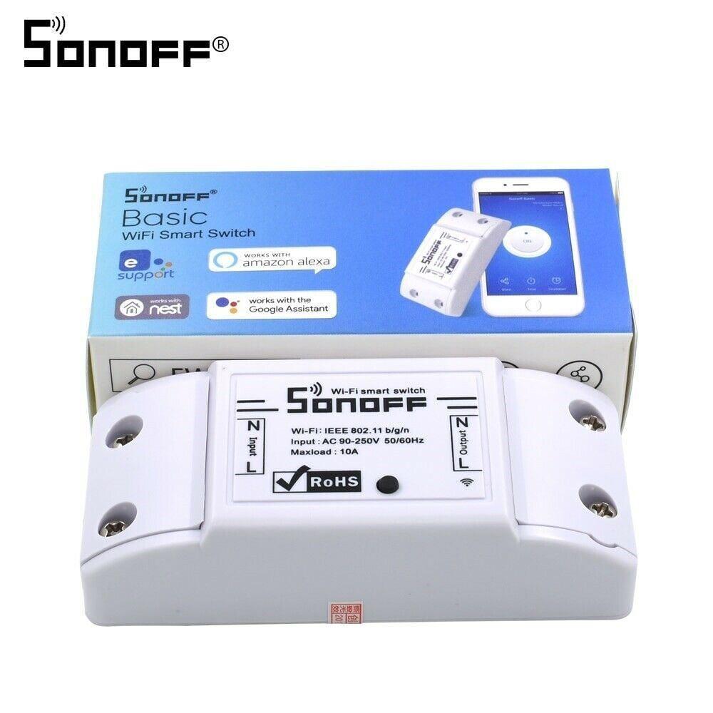

## Sonoff

Tal ha sido el éxito de la plataforma esp8266 y ESP32 que existen producto comerciales que lo incorporan. Además, el fabricante ha incluído en la placa conectores para poder modificar su funcionamiento y añadir componentes pudiendo hasta cambiar su firmware.

Sonoff son un conjuto de productos pensados para la domótica, que incluyen interruptores, reles, controladores de ventiladores, etc y que permiten su control remotor vía wifi y la integración en sistemas de control domésticos.

## Pinout

