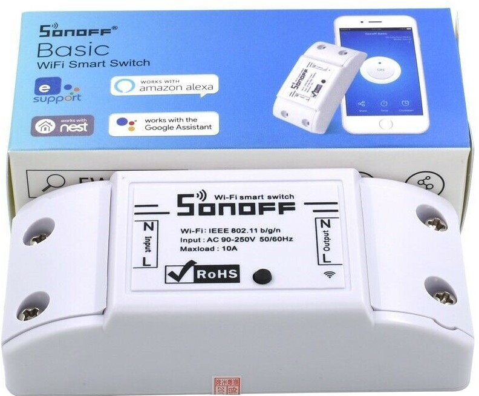

## Sonoff

Tal ha sido el exito de la plataforma esp8266 y ESP32 que existen producto comerciales que lo incorcoran. Además el fabricante ha incluído el la placa conectores para poder modificar su funcionamiento, añadir componentes pudiendo hasta cambiar su firmware.

Sonoff son un conjuto de productos pensados para la domótica, que incluyen interruptores, reles, controladores de ventiladores, etc y que permiten su control remotor vía wifi y la integración en sistemas de control domésticos.

## Pinout

