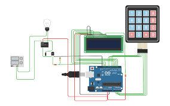
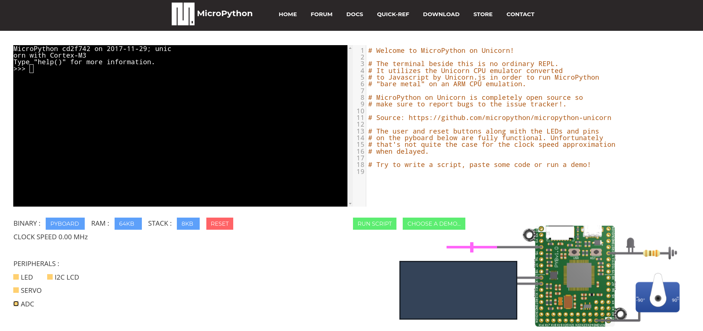
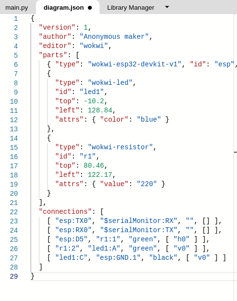

# Simuladores de micropython online

Si no tenemos un placa micropython también podemos probarlo usando un simulador. Cada vez existen más simuladores online que incluyen la programación y el montaje de circuitos, con posibilidad de programar con código o con bloques.

El más conocido de todos, sin duda es [Tinkercad](https://tinkercad.com) (Sí, ademas de diseñar en 3D, también permite simular circuitos y su programación).

Vamos a ver un par de ejemplos que permiten simular placas con micropython.

## Unicorn

El [simulador Unicorn](https://micropython.org/unicorn/)  simula una placa pyboard, lo creó Damien George, el creador de micropython para poder testear el desarrollo.

Nos permite configurar los periféricos conectados a nuestra placa y trabajar con ellos.

## wokwi

[Wokwi](https://wokwi.com) es un simulador de proyectos electrónicos para Arduino, ESP32 y Raspberry Pico que nos permite programarlo con C++ y micropython. También hace una simulación del montaje  y de la programación

Después de crear el circuito podemos cambiar los valores de los componentes o los colores de los cables desde l parte de diseño

¿Pero como no conocía yo esta maravilla?

Es un proyecto en desarrollo, pero que ya funciona muy bien.
