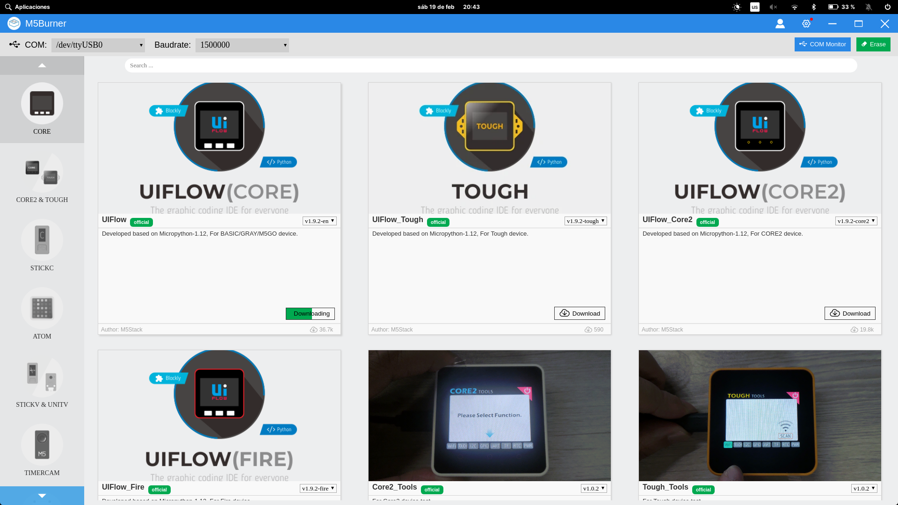
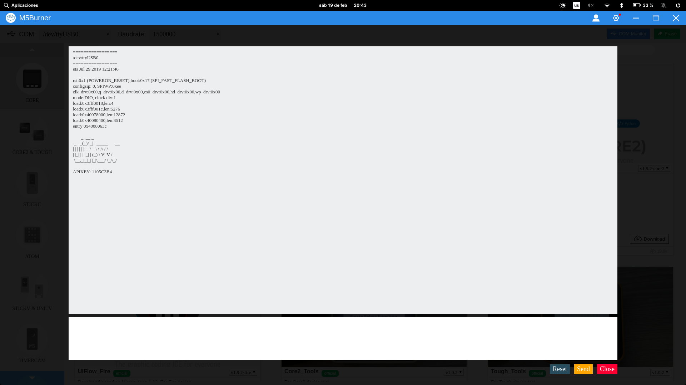
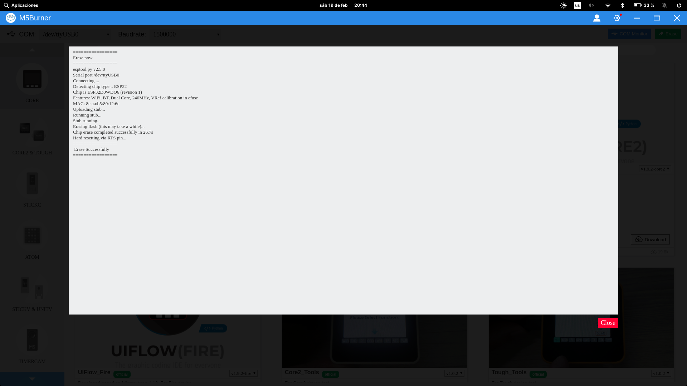
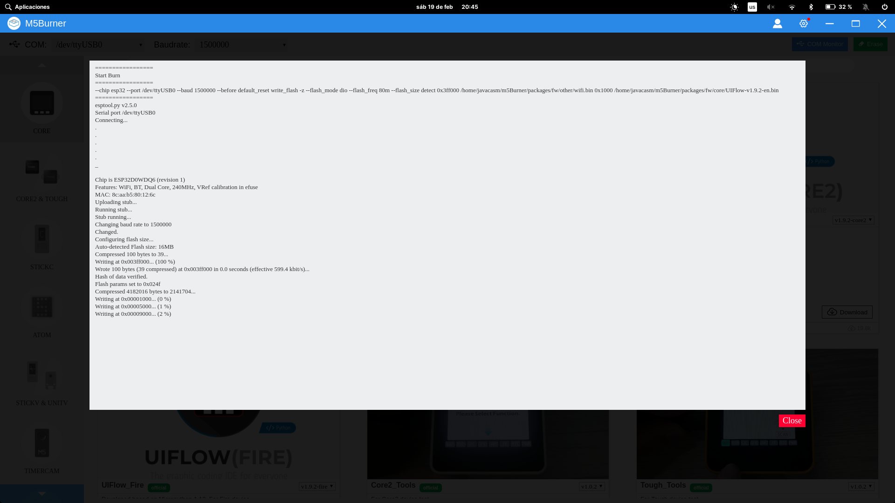
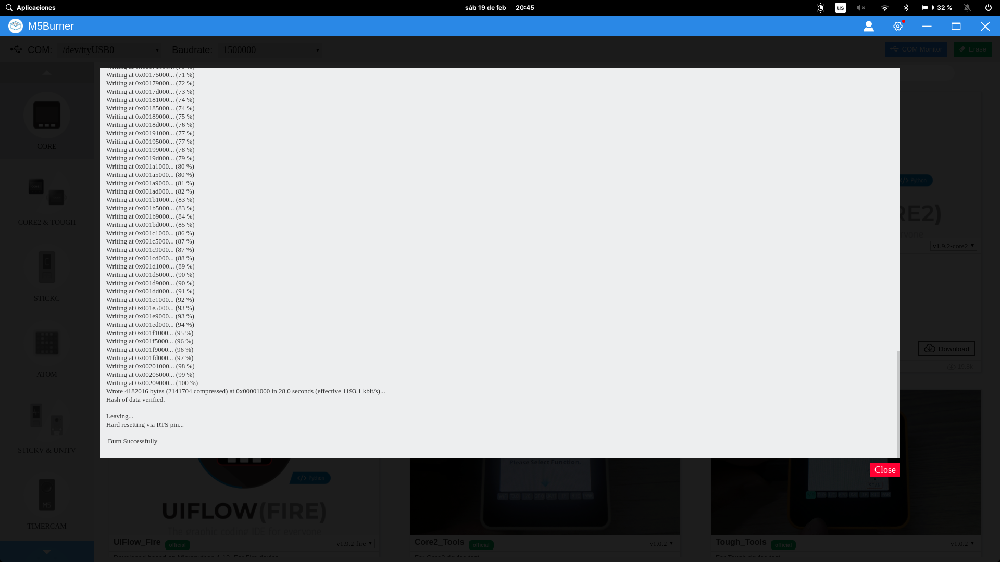
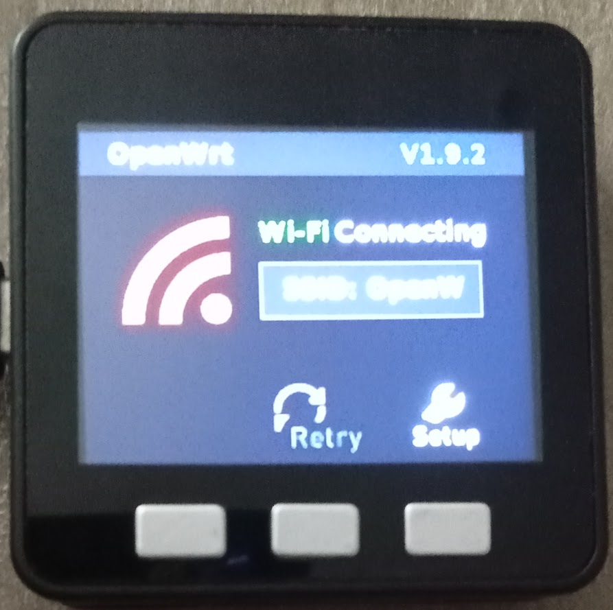
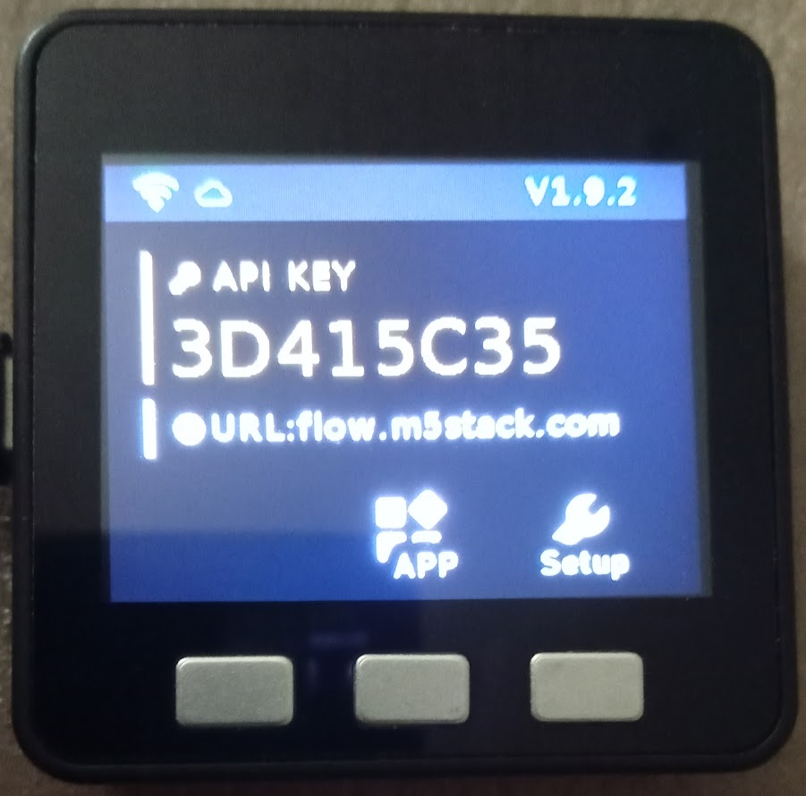
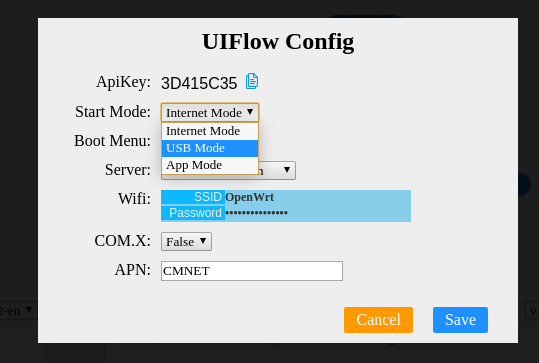
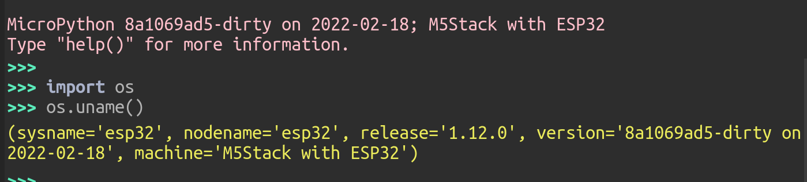

## Instalación de micropython en dispositivos m5Stack

Ya hemos hablado de que el fabricante m5stack ha creado unos dispositivos muy completos y con un acabado completamente profesional. Del mismo modo los ha dotado de un sistema operativo totalmente profesional y muy bien terminado, que los hace programables de forma muy sencilla mediante un entorno visual de bloques __UIFlow__ y con micropython. Además incluye en su firmware:

* Todos los módulos necesarios para usar sus dispositivos: pantalla, acelerómetro, gestor de energía, etc... 
* Un excelente módulo que nos permite programar de forma muy sencilla aplicaciones complejas visualmente.
* Multitud de aplicaciones de ejemplo

La única pega es que no actualiza su micropython desde la versión 1.12

Nosotros podemos flashearle un firmware estándar de ESP32, pero perderemos estos módulos. En cualquier caso podemos cambiar entre el firmware estándar y el del fabricante sin más que flashear el que queramos usar.

### Instalación del firmware del fabricante

Vamos a ver como instalar el firmware del fabricante:

* Desde su [página de descargas](https://docs.m5stack.com/en/download) descargamos la versión adecuada de __UIFLOW FIRMWARE BURNING TOOL__ para nuestro sistema operativo. Se llama **m5Burner**.

* La ejecutamos y seleccionamos el modelo de nuestro m5stack en el lateral

* Vemos que podemos seleccionar el puerto de comunicaciones donde está conectada nuestra placa y la velocidad de comunicación, que se selecciona automáticamente.

* Podemos usar un terminal de consola para ver lo que se envía por el puerto serie

* Borramos la memoria flash

* Seleccionamos el firmware que queremos flashear, para micropython 1.12 UIFlow

* Pulsamos en __Download__ para descargar el fichero del firmware

* Una vez descargado pulsamos "Burn" para escribir el firmware

* Una vez terminada la escritura ....

* Una vez flasheado, ya tenemos el dispositivo con el firmware. Ahora elegiremos el modo de funcionamiento , pulsando el botón de __Setup__

* En todo momento podemos configurar el comportamiento del firmware que tiene varios modos, según trabajemos conectados al IDE UIFlow de internet, o el APP Mode, que nos permite elegir el fichero que se va a ejecutar

* Ya podemos conectarnos usando Thonny

