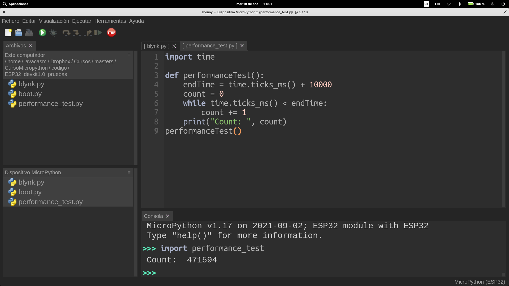
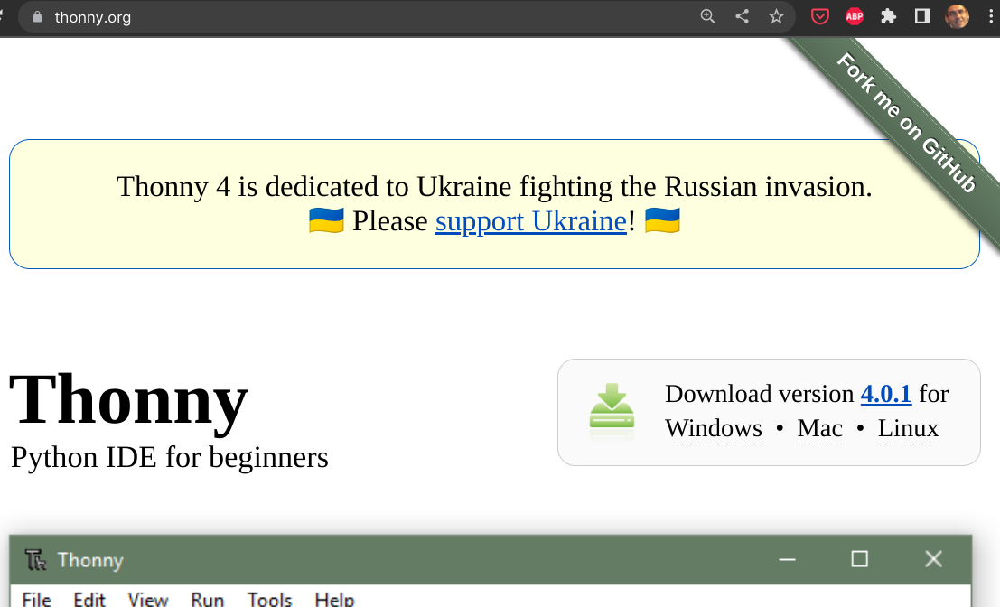
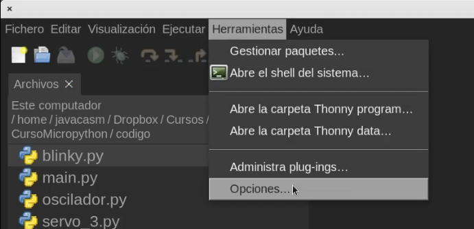
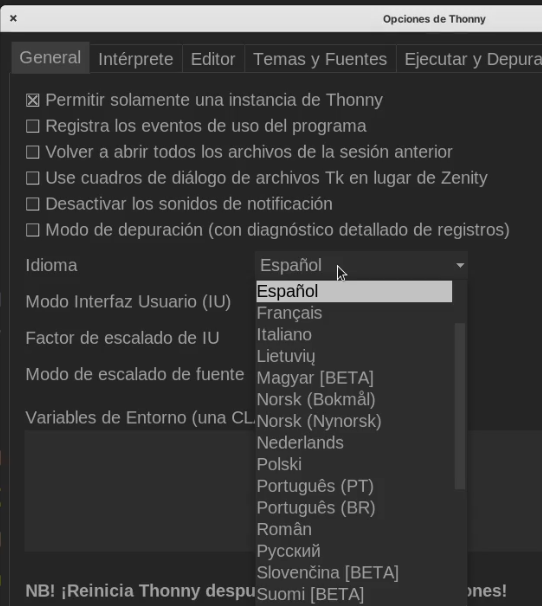
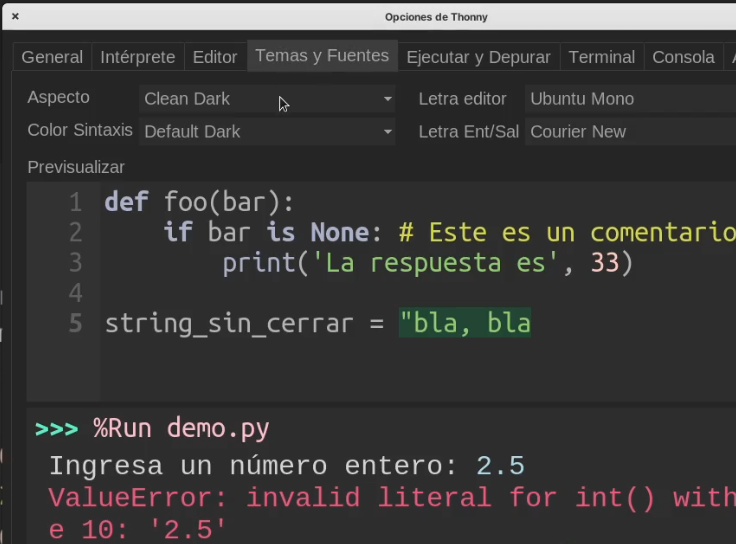

## Thonny

Thonny es un editor Open Source ([en este repositorio](https://github.com/thonny/thonny) está su código) pensado para trabajar con Python y está disponible para los principales sistemas operativos de PC o similares: Linux, MacOS, Windows, Raspberry,...

Nos permite trabajar con el lenguaje Python en diferentes tipos de entornos. Por ejemplo podemos hacer programas para nuestro PC (juegos, páginas web,...) y también podemos programar para distintos dispositivos como por ejemplo microcontroladores o sistemas más complejos y soportan este lenguaje.

Cómo curiosidad decir que Thonny está escrito en Python y podemos ejecutar y depurar su propio código utilizando el mismo editor

Además incluye las herramientas necesarias para poder transferir el firmware de micropython a nuestro dispositivo para trabajar con él.

También nos permite organizar nuestro código en ficheros que podemos transferir entre la placa con micropython y el PC al que esté conectada.

### Instalación de Thonny

Para instalarlo, descargamos desde [su web](https://thonny.org) el instalador y lo ejecutamos.

Según nuestro sistema operativo y según las características de éste, usaremos un instalado u otro.

Si nuestro sistema operativo es de la familia **Windows**, y dependiendo de que usemos un sistema de 32 o de 64 bits y también de que queremos hacer una instalación en el sistema o sólo copiar los ficheros necesarios en un directorio (instalación portable), que también nos serviría para tenerlo disponible desde un pendrive USB, usaremos una u otra versión.
Como nos avisan, al instalarlo, el sistema nos puede avisar de que el certificado con el que está firmado todavía no está reconocido por Microsoft y debemos aceptar seleccionando “Mantener”

](https://drive.google.com/file/d/1MzPOHE7vCj482CQhV7m7ZcZ99B-jWzUN/view?usp=sharing)

[Vídeo: Instalación del editor thonny para trabajar con micropython](https://drive.google.com/file/d/1MzPOHE7vCj482CQhV7m7ZcZ99B-jWzUN/view?usp=sharing)

### Idioma y aspecto

Podemos modificar el idioma desde la ventana de opciones (Menú Herramientas -> Opciones), 

en el desplegable Idioma de la pestaña General

También podemos modificar el aspecto seleccionando dentro de la pestaña "Temas y Fuentes" el aspecto y el color de la sintaxis entre los diferentes temas:

[Vídeo: Cambiando el  idioma y el aspecto de Thonny](https://drive.google.com/file/d/1Cm3jT0t02wbxcsdSlMpNwhWpcaQ02BM-/view?usp=sharing)
