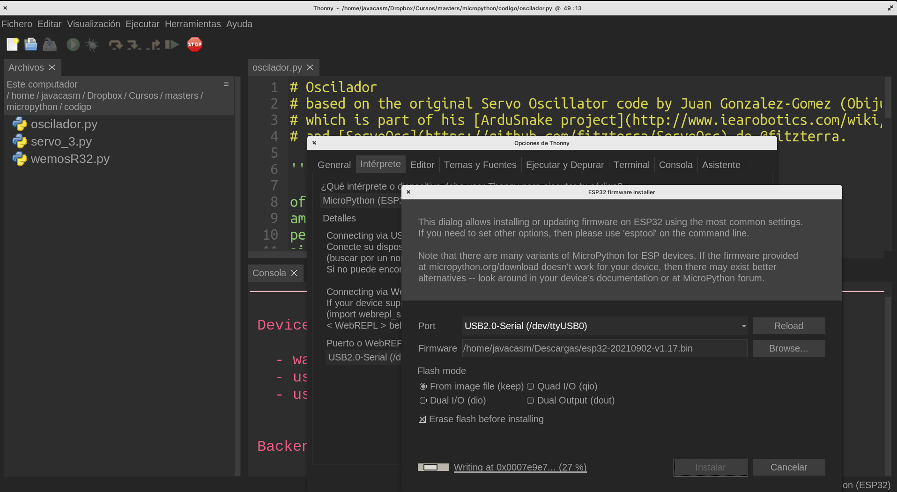

## Instalación del firmware de micropython

Antes de trabajar con micropython en nuestra placa tenemos que instalarle el firmware adecuado. Podemos pensar que es un proceso similar a formatear un ordenador nuevo e instalarle el sistema operativo, lo haremos sólo una vez y al principio antes de usarlo.

También lo volveremos a hacer en caso de querer actualizarlo a una versión posterior. En ese caso tenemos que asegurarnos de hacer copia de los ficheros que hayamos instalado posteriormente a su instalación.

Desde la [página de descargas de Micropython](https://microptyhon.org/download/) descargamos el firmware para nuestra placa. Suele ser un archivo con extensión **bin** o **uf2**, según el dispositivo.

A veces podemos ver que una misma placa tiene varias opciones, dependiendo de sus características. Por ejemplo para las placas esp8266 tenemos versión para placas con 512Kb, 1M o más de memoria flash.

Una vez descargado, vamos a enviarlo a la placa que habremos conectado al USB del PC desde el editor Thonny.

Desde el menú Ejecutar pulsamos la opción "Elegir Intérprete"

Que nos abrirá una ventana donde seleccionamos el intérprete adecuado para nuestra placa:

En nuestro caso ESP32

Ahora pulsamos la opción de "Instalar o actualizar el firmware

Seleccionamos el puerto al que está conectada la placa y el fichero del firmware que hemos descargado. Algunas placas necesitan opciones diferentes a las por defecto (eso lo comentaremos más adelante para cada placa). Sí que nos debemos asegurar de que esté marcada la opción de borrar previamente la memoria flash (Erase flash before installing).

Pulsamos el botón instalar y se grabará el firmware en la placa y se verificará la escritura.

El proceso lleva unos minutos.

En algunos caso puede ocurrir que nos falta la herramienta de grabación (esptool) o alguna de las que depende, obteniendo un error:

Podemos solucionarlo desde el menú Herramientas -> Administrar plugins (complementos)

Escribimos el que nos falta (normalmente esptools)

Lo instalamos

Ya podemos instalar el firmware en nuestra placa

[Vídeo: Instalación del  firmware de micropython desde Thonny](https://drive.google.com/file/d/13jT3f-Rpg0B3hGgYMIPP_kP-4qlEFC0n/view?usp=sharing)

