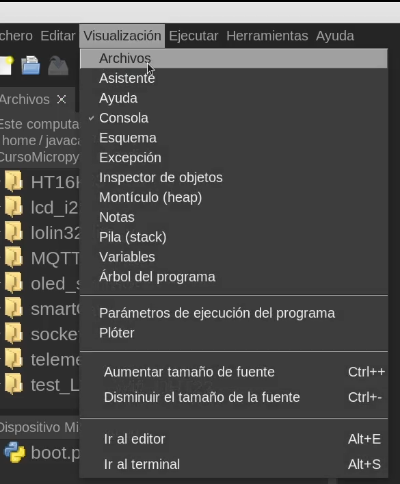
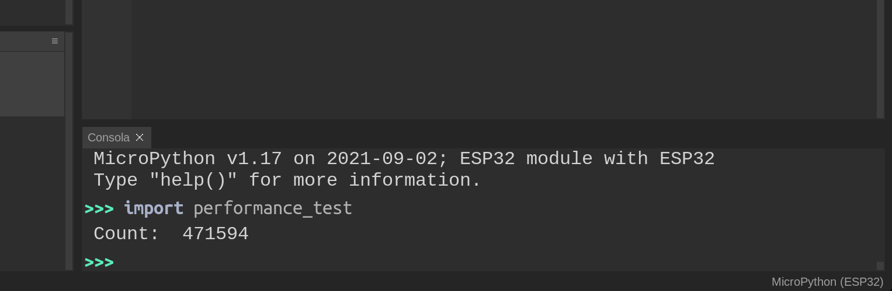
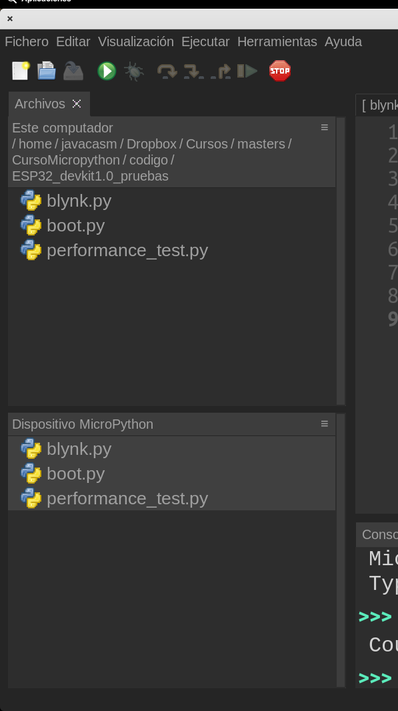
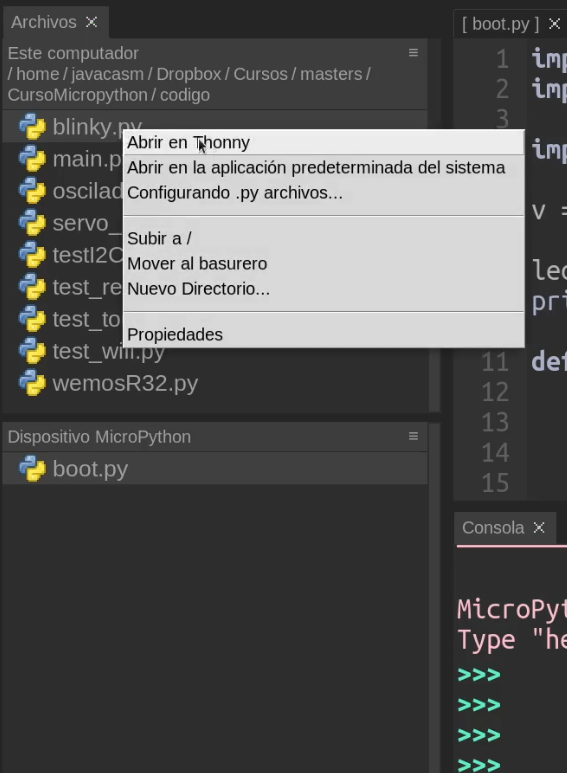
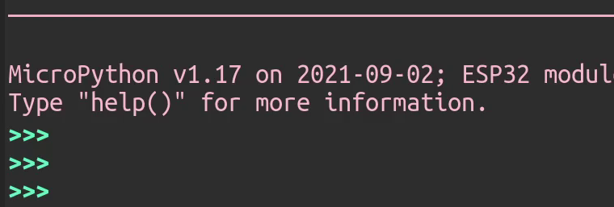
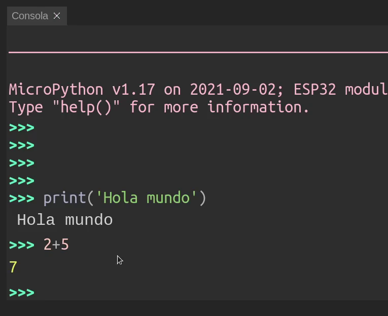
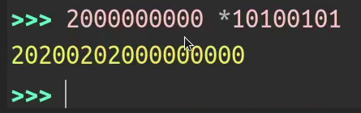

### Uso de Thonny

El entorno Thonny tiene diferentes apartados dentro de su ventana principal, cada uno con diferente uso.


En todo momento podmemos cerrar estas ventanas pudiéndolas volver a abrir desde el menú **Visualización**



Cuando trabajamos con micropython usando Thonny (hemos seleccionado el intérprete adecuado) y tenemos conectada nuestra placa, veremos abajo lo que denominamos la **consola** (o terminal).



Es una parte del editor que nos permite trabajar interactivamente con nuestra placa. Esta característica se denomina REPL, Read-Evaluate-Print Loop o bucle de lectura, evaluación e impresión. En este modo el intérprete nos devolverá por pantalla el resultado de la expresión que hayamos introducido. Es un modo interactivo, pensado para ir creando o probando nuestro código.

Personalmente es una de las características que más me gustan de micropython, que me permite desarrollar rápidamente prototipos que evolucionan con facilidad a proyectos más acabado y complejos.

En la parte de la derecha veremos los ficheros, arriba los que están en el ordenador y abajo los que están en nuestra placa. Thonny nos va a mostrar todos los ficheros, aunque sólo puede editar los de código.

El poder usar un sistema de archivo en nuestra placa es una característica muy avanzada que nos va a permitir trabajar con micropython casi como en un sistema de alto nivel.



Si pulsamos sobre cualquiera de ellos se abriran en el editor central, mostrando el nombre entre corchetes "[...]" si el fichero está en la placa o sin ellos si está en el PC.

Al crear un fichero nuevo, seleccionamos si se crea en el PC o en la placa


Podemos transferir ficheros entre la placa y el PC pulsando sobre ellos con el botón derecho del ratón y eligiendo la opción de enviar al otro 



### Uso de la consola

En la consola podemos ejecutar órdenes de manera interactiva. Al conectar la placa veremos el símbolo del intérprete (Prompt) 

```python
>>>
```
Que nos dice que está dispuesto a ejecutar nuestras instrucciones. 



Vamos a empezar haciendo el habitual "Hola mucho", que nosotros podemos adaptar a "Hola Python!!", en la consola.

Para ello escribiremos 

```python
print('Hola Python!!')
```

Y al pulsar "Enter", tendremos el resultado:

```python
  Hola Python!!
```


También podemos hacer todo tipo de operacaiones matemáticas:

```python
>>> 2+5
  7
```



O incluso operaciones mucho más complicadas



[](https://drive.google.com/file/d/1EY7so0zaGoWa8lE_LkfqSC4pnDkX7mdg/view?usp=sharing)

[Vídeo: Uso de Thonny, ficheros y primeras pruebas con  la consola interactiva](https://drive.google.com/file/d/1EY7so0zaGoWa8lE_LkfqSC4pnDkX7mdg/view?usp=sharing)

### Reseteando la placa

A veces ocurre que necesitamos resetear nuestra placa, bien porque hay un problema de conexión o bien porque nuestro código tiene algún fallo. En ese caso podemos  resetear nuestra placa pulsando el botón de reset, si lo tienen. También podemos hacerlo pulsando desde la consola "Ctrl + D", con lo que se mostrará el mensaje de bienvenida de nuestra placa (Banner).

También podemos resetear tanto la placa como la conexión con Thonny pulsando el bóton rojo de Thonny

[](https://drive.google.com/file/d/1xa1M2I1YBvTQPHda-ZxlKq8ppkFAN7JB/view?usp=sharing)

[Vídeo: Reseteando nuestra placa con Ctrl+D](https://drive.google.com/file/d/1xa1M2I1YBvTQPHda-ZxlKq8ppkFAN7JB/view?usp=sharing)


### Histórico de comandos

Una característica muy cómoda de la consola es que podemos recuperar cualquier comando que hemos usado antes sin más que pulsar la tecla hacia arriba del cursor. Es lo que se conoce como el **Histórico de comandos**. 

Podemos desplazarnos hacia atrás o hacia adelante con las flechas arriba y abajo del cursor.


### Variables

Podemos imaginar una variable como una caja a la que le damos un nombre y que es capaz de almacenar un valor, que puede cambiar. Las variables tiene también un tipo, que en Python viene definido por el valor que le damos.

Aunque no tenemos que decirlo explícitamente en Python las variables tienen tipo. Llamamos asignación al hecho de dar a una variable un valor dado.

```python
a = 10
```

Podemos imprimir su valor con 

```python
>>> print(a)
10
```

Podemos operar con variables igual que con números

```python
>>> b = 5
>>> print(a + b)
15
```
También podemos usar variables que guardan texto
En la siguiente línea estamos creando un variable y le damos el valor **Pepe**

```python
 persona = "Pepe"
 print("Hola")
 print(persona)
```

Diremos que hemos declarado la variable **persona** y le asignamos su valor.

Posteriormente podemos cambiar su valor sin más que asignarle otro nuevo.

Vemos cómo distinguimos cuando queremos imprimir un texto literal y el valor de la variable

Para indicar el valor de las variables de tipo texto podemos comillas simples **'** o dobles **"** 

[](https://youtu.be/T8nB3y1qaUk)

[Vídeo: 2.2.4 Trabajando con variable y usando el histórico de comandos](https://youtu.be/T8nB3y1qaUk)


