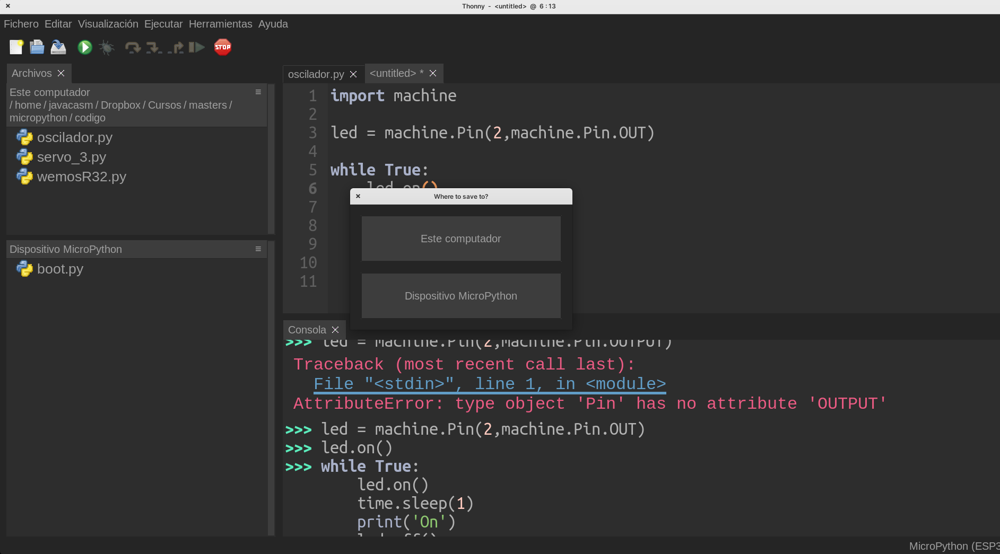

### Uso de Thonny

El entorno Thonny tiene diferentes apartados dentro de su ventana principal, cada uno con diferente uso.


En todo momento podmemos cerrar estas ventanas pudiéndolas volver a abrir desde el menú **Visualización**


Cuando trabajamos con micropython usando Thonny (hemos seleccionado el intérprete adecuado) y tenemos conectada nuestra placa, veremos abajo lo que denominamos la **consola** (o terminal).


Es una parte del editor que nos permite trabajar interactivamente con nuestra placa. Esta característica se denomina REPL, Read-Evaluate-Print Loop o bucle de lectura, evaluación e impresión. En este modo el intérprete nos devolverá por pantalla el resultado de la expresión que hayamos introducido. Es un modo interactivo, pensado para ir creando o probando nuestro código.

Personalmente es una de las características que más me gustan de micropython, que me permite desarrollar rápidamente prototipos que evolucionan con facilidad a proyectos más acabado y complejos.

En la parte de la derecha veremos los ficheros, arriba los que están en el ordenador y abajo los que están en nuestra placa. Thonny nos va a mostrar todos los ficheros, aunque sólo puede editar los de código.

El poder usar un sistema de archivo en nuestra placa es una característica muy avanzada que nos va a permitir trabajar con micropython casi como en un sistema de alto nivel.


Si pulsamos sobre cualquiera de ellos se abriran en el editor central, mostrando el nombre entre corchetes "[...]" si el fichero está en la placa o sin ellos si está en el PC.

Al crear un fichero nuevo, seleccionamos si se crea en el PC o en la placa



Podemos transferir ficheros entre la placa y el PC pulsando sobre ellos con el botón derecho del ratón y eligiendo la opción de enviar al otro 


### Uso de la consola

En la consola podemos ejecutar órdenes de manera interactiva. Al conectar la placa veremos el símbolo del intérprete (Prompt) 

```python
>>>
```
Que nos dice que está dispuesto a ejecutar nuestras instrucciones. 


Vamos a empezar haciendo el habitual "Hola mucho", que nosotros podemos adaptar a "Hola Python!!", en la consola.

Para ello escribiremos 

```python
print('Hola Python!!')
```

Y al pulsar "Enter", tendremos el resultado:

```python
  Hola Python!!
```


También podemos hacer todo tipo de operacaiones matemáticas:

```python
>>> 2+5
  7
```


O incluso operaciones mucho más complicadas


[](https://drive.google.com/file/d/1EY7so0zaGoWa8lE_LkfqSC4pnDkX7mdg/view?usp=sharing)

[Vídeo: Uso de Thonny, ficheros y primeras pruebas con  la consola interactiva](https://drive.google.com/file/d/1EY7so0zaGoWa8lE_LkfqSC4pnDkX7mdg/view?usp=sharing)


