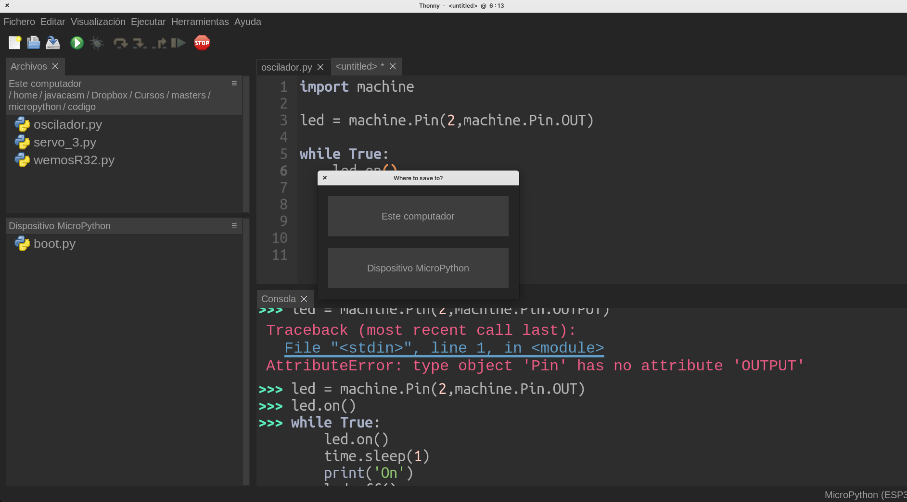

## Thonny


Toni es un editor OpenSource pensado para trabajar con Python y está disponible para los principales sistemas operativos de PC o similares: Linux, MacOS, Windows, Raspberry,...

Nos permite trabajar con el lenguaje Python en diferentes tipos de entornos. Por ejemplo podemos hacer programas para nuestro PC (juegos, páginas web,...) y también podemos programar para distintos dispositivos como por ejemplo microcontroladores o sistemas más complejos y soporten este lenguaje.

Cómo curiosidad decir que Tony está escrito en Python y podemos ejecutar y depurar su propio código utilizando el mismo editor

Además incluye las herramientas necesarias para poder transferir el firmware de micropython a nuestro dispositivo para trabajar con el.

También nos permite organizar nuestro código en ficheros que podemos transferir entre la placa con micropython y el PC al que esté conectada.


### Instalación de Thonny

Para instalarlo, descargamos desde [su web](https://thonny.org) el instalador y lo ejecutamos.

Si estamos familiarizados con el lenguaje Python y lo tenemos instalado en nuestro ordenador podemos instalarlo también con pip

```sh
pip3 install thonny
```

[](https://drive.google.com/file/d/1MzPOHE7vCj482CQhV7m7ZcZ99B-jWzUN/view?usp=sharing)

[Vídeo: Instalación del editor thonny para trabajar con micropython](https://drive.google.com/file/d/1MzPOHE7vCj482CQhV7m7ZcZ99B-jWzUN/view?usp=sharing)


### Idioma y aspecto

[](https://drive.google.com/file/d/1Cm3jT0t02wbxcsdSlMpNwhWpcaQ02BM-/view?usp=sharing)

[Vídeo: Cambiando el  idioma y el aspecto de Thonny](https://drive.google.com/file/d/1Cm3jT0t02wbxcsdSlMpNwhWpcaQ02BM-/view?usp=sharing)


Al crear un fichero seleccionamos si se crea en el PC o en la placa


