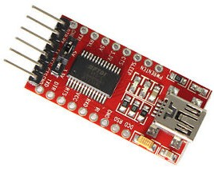
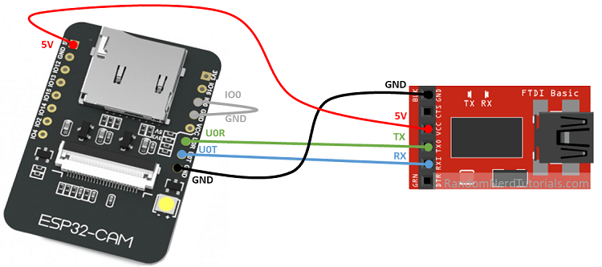

### Instalación Micropython en el ESP32-CAM

 

Cómo esta placa no incluye puerto USB, necesitamos un adaptador USB/serie para reprogramarlo.

Lo conectaremos a los pines del puerto serie (invertidos):

* Vcc del adaptador a 5V de ESP32-CAM
* Ambos GNDs conectados
* Tx del adaptador al U0R del ESP32-CAM
* Rx del adaptador al U0T del ESP32-CAM

Además para poner al ESP32 en modo programación conectaremos el pin IO0 a GND



(Imagen cortesía de RandomNerdTutorial)

Hasta ahora mismo, el firmware original de Micropython no incluye el soporte a cámaras, pero sí que hay versiones creadas a partir del original que lo incluye, como por ejemplo el firmware del [repositorio de Mauro Riva @lemariva](https://github.com/lemariva/micropython-camera-driver/tree/master/firmware), desde donde descargaremos el firmware:

Desde la consola con 

```sh
esptool.py --chip esp32 --port /dev/ttyUSB0 erase_flash
```

Después del borrado flasheamos,  el firmware con:

```sh
esptool.py --chip esp32 --port /dev/ttyUSB0 --baud 460800 write_flash -z 0x1000 esp32-20210902-v1.17.bin
```

