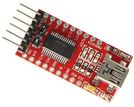
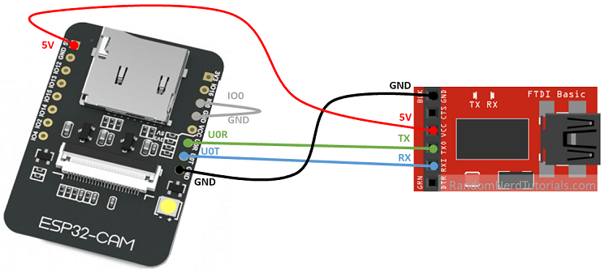

### Instalación en el ESP32-CAM

Cómo esta placa no incluye puerto USB, con lo que necesitamos un adaptador USB/serie para reprogramarlo.

 

que conectaremos a los pines del puerto serie (invertidos):

* Vcc del adaptador a 5V de ESP32-CAM
* Ambos GNDs conectados
* Tx del adaptador al U0R del ESP32-CAM
* Rx del adaptador al U0T del ESP32-CAM

Además para poner al ESP32 en modo programación conectaremos el pin IO0 a GND

Descargamos el firmware desde el [repositorio de lemariva](https://github.com/lemariva/micropython-camera-driver/tree/master/firmware)

Desde la consola con 

esptool.py --chip esp32 --port /dev/ttyUSB0 erase_flash

After erasing the flash, you write the MicroPython fimware starting at address 0x1000 by typing:

esptool.py --chip esp32 --port /dev/ttyUSB0 --baud 460800 write_flash -z 0x1000 esp32-20210902-v1.17.bin

[Tutorial de instalación](https://lemariva.com/blog/2022/01/micropython-upgraded-support-cameras-m5camera-esp32-cam-etc)