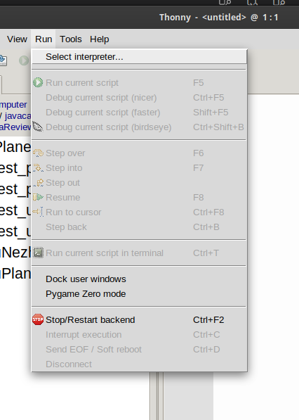
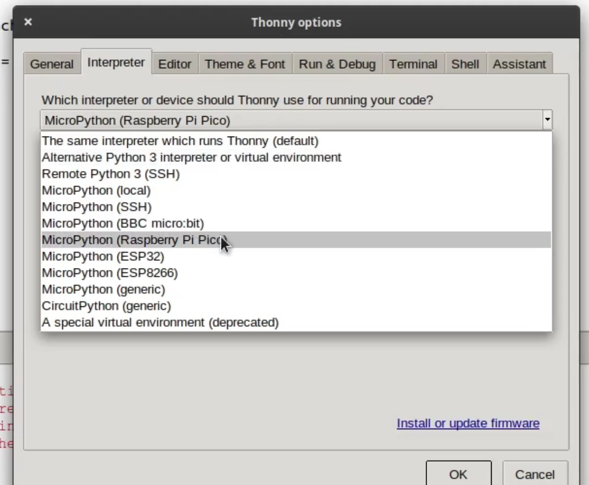
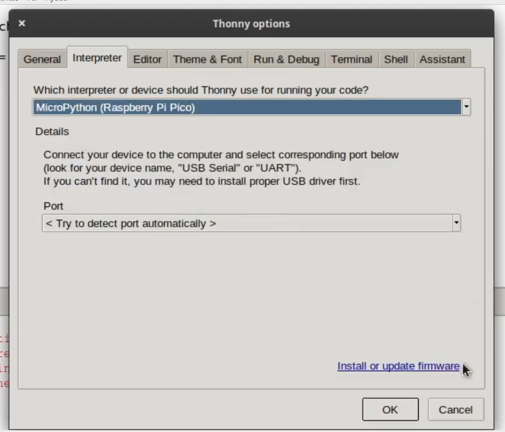
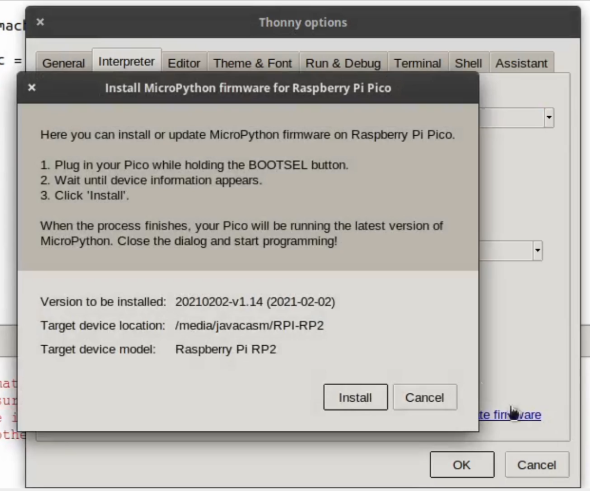
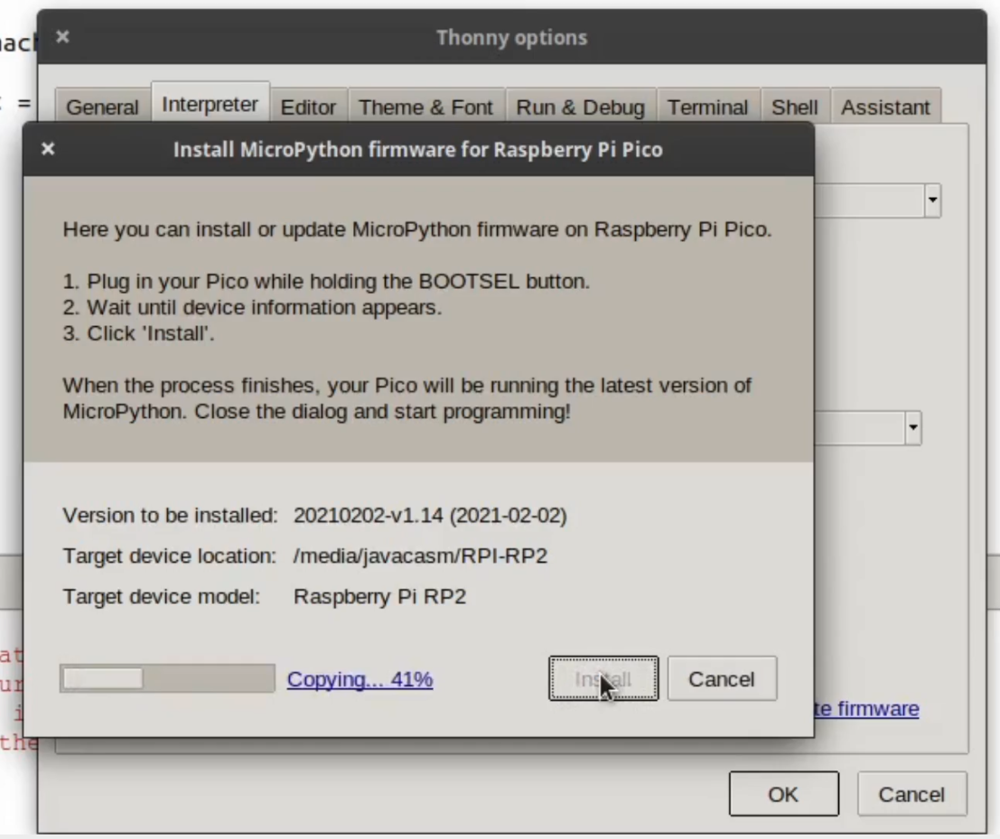
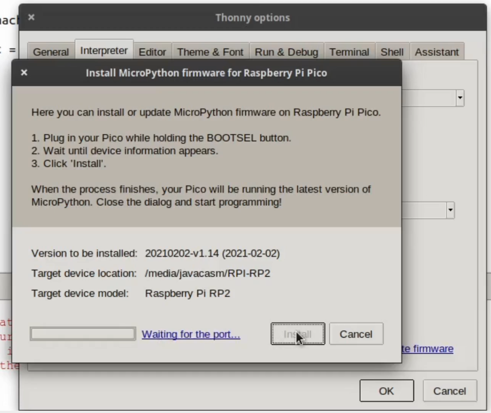
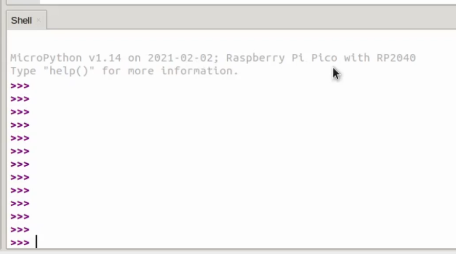
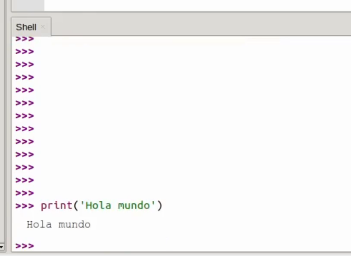

#### Uso micropython en Raspberry Pi Pico

En este vídeo vemos los primeros pasos para instalar el firmware de micropython en una Raspberry Pi Pico desde Thonny



Descargamos el firmware de micropython adecuado, según si nuestra placa es la W o no Lo haremos desde la [página de Raspberry Pi](https://www.raspberrypi.com/documentation/microcontrollers/micropython.html) o desde a [página de descargas de micropython.org](https://micropython.org/download/?vendor=Raspberry%20Pi)

En Thonny seleccionamos el intérprete de python adecuado desde el menú Run -> Select Interpreter y seleccionamos "Micropython(Raspberry Pi Pico)



Desde esta opción tendremos acceso a la instalación del firmware (Dejamos la opción de selección automática del puerto de conexión)



Pulsamos "Install or update firmware"

En la ventana que aparece veremos que se detecta la placa 



y pulsamos Install




Si no vemos el puerto USB puede que la placa haya arrancado en modo USB-disk. En ese caso tendremos un dispositivo de almacenamiento USB llamado RP2 y ahí copiaremos el fichero uf2 correspondiente.

Después de instalarse el firmware se resetea la placa



Una vez instalado el firmware de micropython y tras pulsar la tecla **Enter** aparecerá la descripción del firmware instalado y el prompt de python ">>>" 




### Primera prueba: Hola Mundo



Escribimos nuestra pequeña prueba para ver que funciona el intérprete

```python
print('Hola Mundo')
```


[](https://drive.google.com/file/d/1jNFaPgo1HckDvHj6SmLgEPQWFh6xlxvm/view?usp=sharing)

[Vídeo: Instalación de micropython en una Raspberry Pico usando Thonny](https://drive.google.com/file/d/1jNFaPgo1HckDvHj6SmLgEPQWFh6xlxvm/view?usp=sharing)

