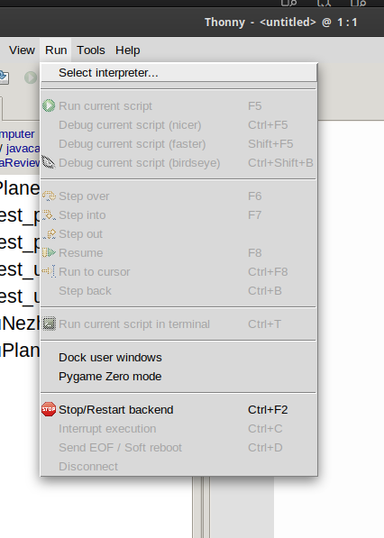
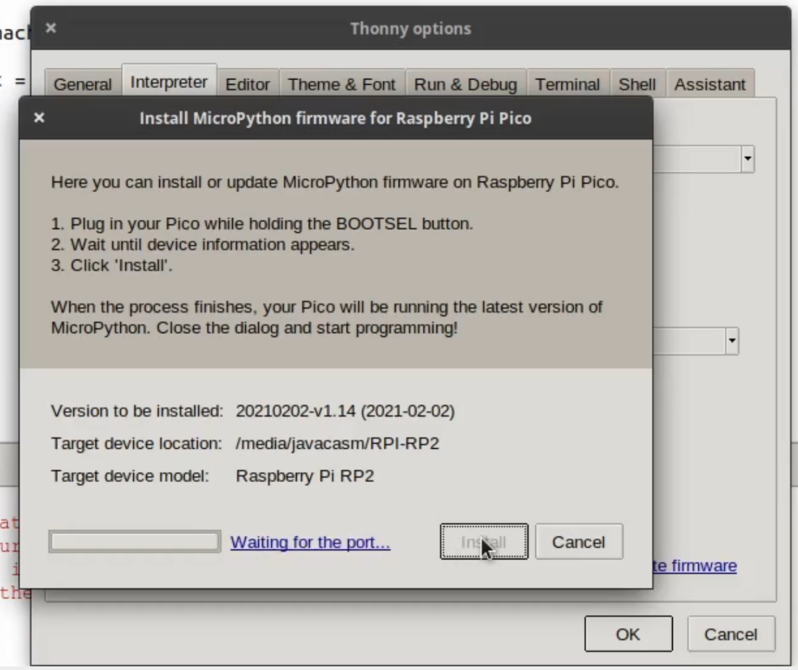
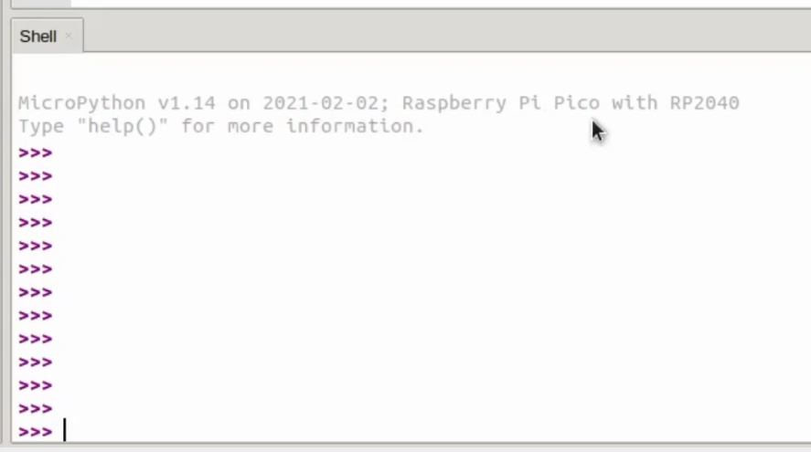

#### Uso micropython en Raspberry Pi Pico

El entorno de programación para micropython es Thonny que podemos instalar fácilmente desde [su página](https://thonny.org/) o desde python con 

```sh
pip3 install thonny
```

Debemos asegurarnos de usar una versión posterior a la 3.3.3, con lo que si ya lo tenemos instalado debemos actualizarlo con 

```sh
pip3 install --upgrade thonny
```

En este vídeo vemos los primeros pasos

[](https://youtu.be/ttwo53KDqII)

[Vídeo: primeros pasos con Raspberry Pi Pico en micropython](https://youtu.be/ttwo53KDqII)

Ahora vamos a instalar el firmware de micropython a la Raspberry Pi Pico.

* Seleccionamos el intérprete de python adecuado desde el menú Run->Select Interpreter



Seleccionando "Micropython(Raspberry Pi Pico)


Desde esta opción tendremos acceso a la instalación del firmware
(Dejamos la opción de seleccion automática del puerto de conexión)


Pulsamos "Install or update firmware"

En la ventana que aparece veremos que se detecta la placa 


y pulsamos Install


Después de instalarse el firmaware se resetea la placa




Una vez instalado el firmware de micropython y tras pulsar la tecla **Enter** aparecerá la descripción del firmware instalado y el prompt de python ">>>" 




### Primera prueba: Hola Mundo

Escribimos nuestra pequeña prueba para ver que funciona el intérprete

```python
print('Hola Mundo')
```


### Ejemplo 1: Led On/Off

Vamos a probar ahora con un ejemplo para encender y apagar el led incluído en la Pico, que está conectado al pin 25

```python
import machine # Todo lo relaciionado con el acceso al hardware

# Creamos un objeto led conectado al pin 25 y como salida
led = machine.Pin(25, machine.Pin.OUT)

led.on() # Encendemos
led.off() # Apagamos
```

### Ejemplo 1.5: Parpadeo de led

Ahora introducimos un retardo y tenemos un led parpadeante. Para ello añadimos el módulo **utime**, una versión reducida del clásico módulo **time**. En micropython algunos módulos llevan una "u" (por la letra griega μ/micro) delante del nombre para indicar que son versiones reducidas 


```python
import machine # Todo lo relacionado con el acceso al hardware
import utime   # utilidades relacionadas con el tiempo

# Creamos un objeto led conectado al pin 25 y como salida
led = machine.Pin(25, machine.Pin.OUT)

while True:
    led.on()
    utime.sleep(0.5)
    led.off()
    utime.sleep(0.5)    

```


