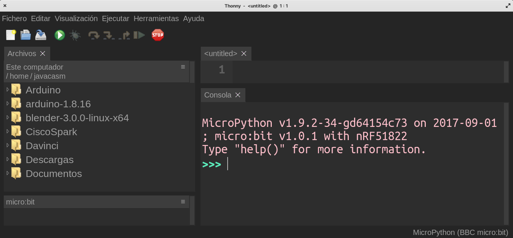

### Instalación de micropython en micro:bit

Actualmente el uso de micropython está recuperando mucho interés para la fundación microbit, por eso están actualizando muchas de sus herramientas para este lenguaje.

Para comenzar a usarlo podemos utilizar el [entorno de trabajo online](https://python.microbit.org/v/3), desde el que descargaremos un fichero hex


1. Conectamos nuestra micro:bit y aparecerá un "Dispositivo USB" (como un pen-drive) llamado Microbit

1. Copiamos el fichero .hex que hemos descargado en el dispositivo

1. Tras arrancar ya podemos conectarnos desde Thonny, seleccionando el intérprete adecuado de micro:bit

1. Seleccionamos el puerto correcto

1. Pulsamos Ctr+C para detener el programa actual

```python
Traceback (most recent call last):
  File "main.py", line 8, in <module>
KeyboardInterrupt: 
MicroPython 16d4380 on 2021-10-25; micro:bit v2.0.0 with nRF52833
Type "help()" for more information.
>>> 

```

Ya tenemos disponible la consola para enviar las órdenes.

#### Instalación estándar

También podemos instalar Micropython en una micro:bit como en otras plataformas:

1. Descargamos el firmware disponible en el [repositorio de Micropython para micro:bit](https://github.com/microbit-foundation/micropython-microbit-v2/releases/download/v2.0.0/micropython-microbit-v2.0.0.hex)

1. Conectamos nuestra micro:bit y aparecerá un "Dispositivo USB" (como un pen-drive) llamado Microbit

1. Copiamos el fichero .hex que hemos descargado en el dispositivo

1. Tras arrancar ya podemos conectarnos desde Thonny, seleccionando el intérprete adecuado.


